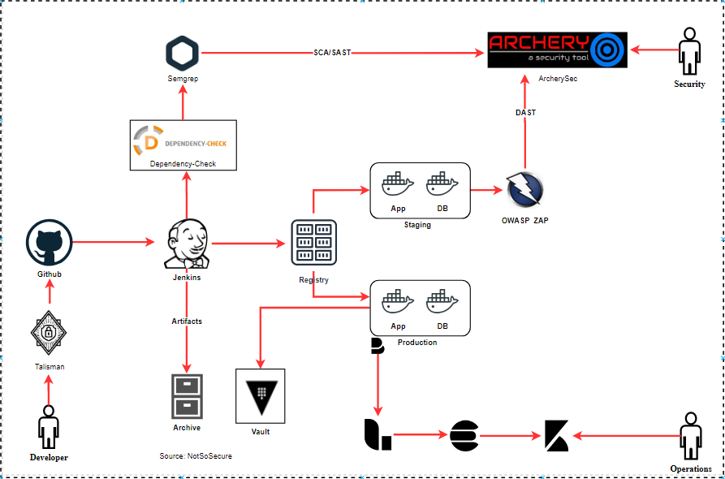

# Dynamic Analysis Security Testing (DAST)

Web application scanners are an important part in doing a vulnerability assessment of a web application. A good majority of these scanners have API end-points or CLI access which can be leveraged to initiate scanning on target applications. OWASP ZAP is one such tool which can be used for initiating a web application security scan on an application in the QA/Staging environment to iron out a vast number of security misconfigurations such as disclosure of sensitive information in a backup file, insecure HTTP header etc.

