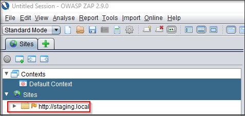
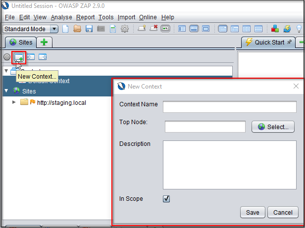
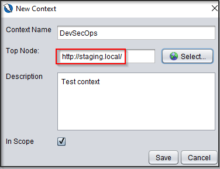
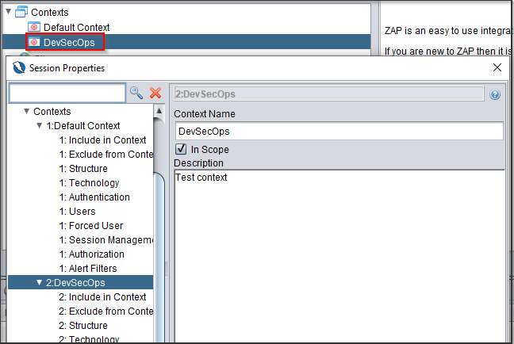
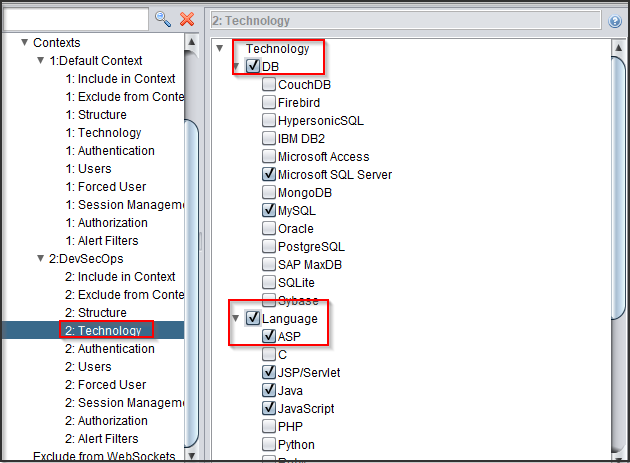
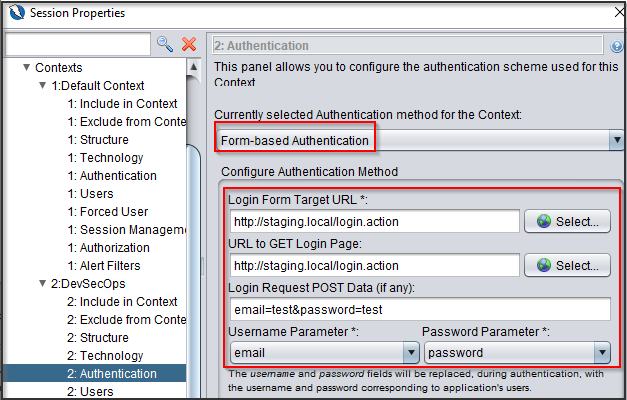
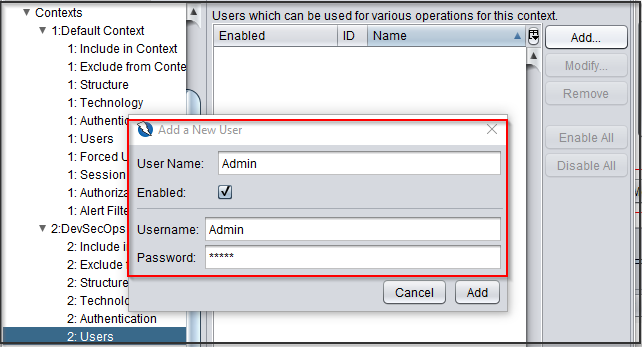

# Introduction to OWASP ZAP

<!--
Add a few lines an pictures on OWASP ZAP
Add Link to browse the ZAP API if its available
Add Steps to show how to create A ZAP Context file
 -->

OWASP ZAP also known as ZAP proxy is most popular open source dynamic scanner. OWASP ZAP can be used to automatically identify vulnerabilities in web applications. OWASP ZAP works as an intercepting proxy as well which can assist developer to identify vulnerabilities during run time of the application. OWASP ZAP supports active and passive scanning including inbuilt fuzzing capability as well.

OWASP ZAP also has powerful API which allows developers to identify vulnerabilities and perform security testing on web applications automatically

Below mentioned is a detailed documentation for OWASP ZAP API

<https://www.zaproxy.org/docs/api/#introduction>

  

### Creating ZAP Context File

OWASP ZAP provides a mechanism to perform authenticated scan using context file.

Please follow the below steps to create context file :

First we need to configure our browser with ZAP proxy so that our application request and responses are intercepted by ZAP as shown below

Next click on new context file option and add context name and description in OWASP ZAP as shown below

Next under nodes select the website in scope which needs to be scanned as shown

Double click on the newly created context file to open the configuration menu as shown below

Next under Technology menu, select the relevant technology to ensure that the scanning performed is accurate and less time consuming

Next under Authentication tab, select Form-based Authentication and enter the relevant details as shown

Next select Users tab and enter the Username and password for authentication scan to be performed

The context file has now been created. This context file can be exported and used locally within a project for ZAP API as well.
