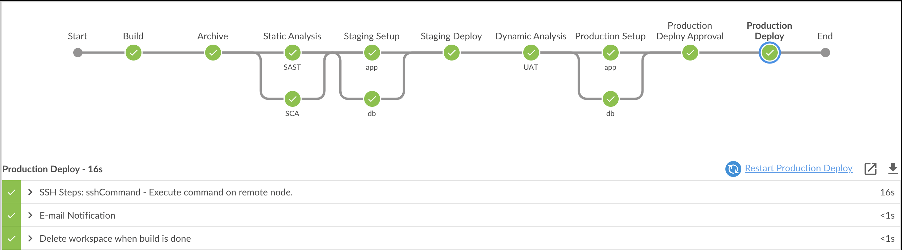

# Fixing SAST Issues

## Lets now fix the identified high and medium issues

#### Lets first fix the XML_DECODER high vulnerability

To fix XML_DECODER vulnerability go to the below path in IDE and comment the below piece of code displayed in code folder

`src/main/java/com/notsosecure/devsecops/actions/api/StudentAddApi.java`

```java
//	VULNERABLE CODE
//	@Action("/api/add")
	public String execute() throws Exception {
		System.out.println("Inside Student Add");
		StudentService studentService = new StudentService();
		xmlString = servletRequest.getInputStream();
		XMLDecoder xmlDecoder = new XMLDecoder(xmlString);
		Student student = (Student) xmlDecoder.readObject();
//		Student student = new Student("test","test","test","test","test","test@test.com");
//		System.out.println(student.getFirstName());
		String result;
		result=studentService.save(student.getUserName(), student.getPassword(), student.getFirstName(), student.getLastName(),
				dateFormat.format(student.getDateOfBirth()), student.getEmailAddress());
		PrintWriter printWriter = servletResponse.getWriter();
		switch (result) {
		case "SignupFailure-UserNameExists":
			printWriter.println("Username Exists");
			break;
		case "SignupSuccess":
			printWriter.println("Users Added Successfully");
			break;
		case "SignupFailure":
			printWriter.println("Something Went wrong");
			break;
		default:
			break;
		}

		return NONE;
	}
```

#### Lets first fix the OBJECT_DESERIALIZATION High vulnerability now

To fix OBJECT_DESERIALIZATION vulnerability go to the below path and comment the below mentioned piece of code and replace with fixed code

`src/main/java/com/notsosecure/devsecops/util/SerializeObject.java`

Comment this code

```java
// VULNERABLE CODE
	 public static Object stringToObject(String s) {

	 	byte[] data = Base64Utils.decodeByte(s);
	 	ObjectInputStream ois;
	 	Object o = new Object();
	 	try {
	 		ois = new ObjectInputStream(new ByteArrayInputStream(data));
	 		o = ois.readObject();
	 		ois.close();

	 	} catch (EOFException e) {
	 		// TODO Auto-generated catch block
	 		e.printStackTrace();
	 	} catch (ClassNotFoundException e) {
	 		// TODO Auto-generated catch block
	 		e.printStackTrace();
	 	} catch (IOException e) {
	 		e.printStackTrace();
	 	}
	 	System.out.println(o.toString());
	 	return o;
	 }
```
Uncomment the below fixed code

```java

	public static Object stringToObject(String s) {

		return new StudentSer("goku");

	}
```

#### Lets first fix the SQL_INJECTION medium vulnerability now

To fix SQL_INJECTION vulnerability we need to make two changes:

First change - Go to the below path and replace the existing piece of code with below code

`src/main/java/com/notsosecure/devsecops/service/StudentService.java`

```java
public String findByLogin(String userName, String password) {
		String result = "LoginFailure";
		if (studentRepository != null) {
//			boolean status = studentRepository.findByLoginSQL(userName, password);
			boolean status = studentRepository.findByLogin(userName, password);
			if (status) {
				result = "LoginSuccess";
			}
		}
		return result;
	}


```
Second change - Go to the below path and comment the below mentioned piece of code and replace with fixed code

`src/main/java/com/notsosecure/devsecops/respository/StudentRepository.java`

Comment this code


```java
// VULNERABLE CODE
	 public boolean findByLoginSQL(String userName, String password) {
	
	 	if (dbConnection != null) {
	 		try {
	
	 			Statement stmt = dbConnection.createStatement();
	 			 ResultSet rs;
	 			 rs = stmt.executeQuery("select password from student where userName="+userName);
	 			 if (rs != null) {
	 					while (rs.next()) {
	 						if (rs.getString(1).equals(password)) {
	 							return true;
	 						}
	 					}
	 				}
	 		} catch (Exception e) {
	 			e.printStackTrace();
	 		}
	 	}
	 	return false;
	 }
```

Uncomment the below fixed code

```java
public boolean findByLogin(String userName, String password) {
		if (dbConnection != null) {
			try {
				PreparedStatement prepStatement = dbConnection
						.prepareStatement("select password from student where userName = ?");
				prepStatement.setString(1, userName);

				ResultSet result = prepStatement.executeQuery();
				if (result != null) {
					while (result.next()) {
						if (result.getString(1).equals(password)) {
							return true;
						}
					}
				}
			} catch (Exception e) {
				e.printStackTrace();
			}
		}
		return false;
	}
   ```


Fire the below Git Commands to execute the Pipeline

```bash
git add .
```

```bash
git commit -am "Fixed SAST"
```

```bash
git push
```

Now we observe that the build is successful as shown below :



