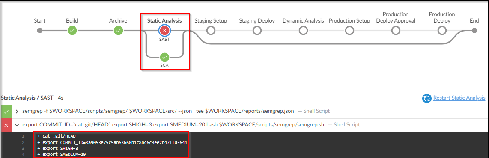
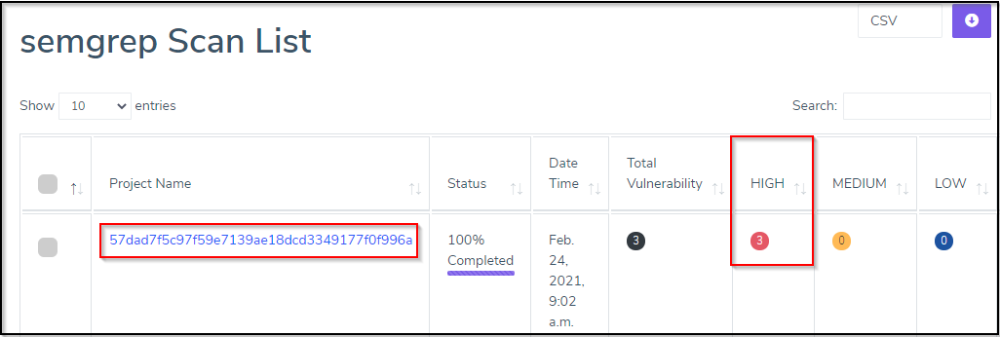

# Integrating Semgrep in DevOps pipeline

<!-- Please update with relevant screenshots -->

1. Copy Contents of `Jenkinsfile.SAST`

2. Paste the Contents into `Jenkinsfile` and Commit the code.

3. Fire the below Git Commands to execute the Pipeline

```bash
git add .
```

```bash
git commit -am "SAST"
```

```bash
git push
```



Post execution of pipeline we observe that build has failed due to high issues.

Let's observe Semgrep Scanning results in Archerysec as shown below :

[ArcherySec URL](../../labsetup/lab_info.md#archerysec)


