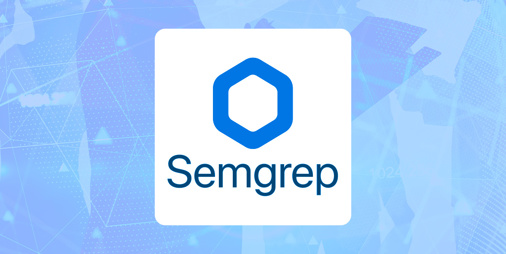

# Introduction to Semgrep

Semgrep is a fast, open-source, static analysis tool that excels at expressing code standards — without complicated queries — and surfacing bugs early at editor, commit, and CI time.

Semgrep offers various unique advantages as compared to other open source SAST tools as listed below:

Semgrep allows us to define custom rules for identifying vulnerabilities, thus helping us run a contextual scan on our code. Additionally, Semgrep offers a public registry of such custom rules that can be used.
Semgrep is extremely fast and is the most suitable to be introduced in a DevOps pipeline.

It spools a well-formatted and stable JSON output.It is extremely lightweight and has an easy to install binary. Can also be run using Docker.
Most importantly, Semgrep supports Python, JavaScript, Java, Go, C and JSON syntaxes!

For a more detailed introduction to Semgrep do checkout our blog [https://notsosecure.com/semgrep-a-practical-introduction/](https://notsosecure.com/semgrep-a-practical-introduction/)

  

