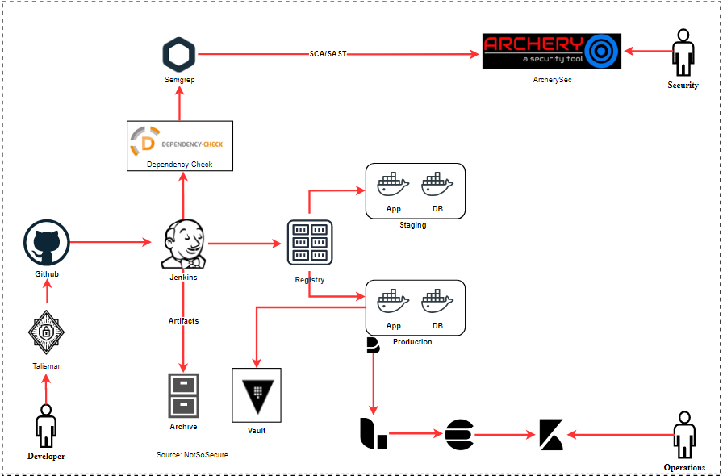

# Static Analysis Security Testing (SAST)

<!-- Write in brief about SAST -->

Static Analysis Security Testing or White box security testing is a process to identify issues/security vulnerabilities by analyzing the source code.

SAST helps in weeding out low-hanging fruits like SQL Injection, Cross-Site Scripting, insecure libraries etc

 SAST tools performs an in-depth analysis of the code(without giving out too many false-positives) and gives a comprehensive report for all the vulnerabilities that have been identified in the code. A decision can be made depending upon the number and severity of vulnerabilities to either continue running the pipeline or fail it to fix the vulnerabilities before the pipeline can continue.

 Typically, SAST includes both manual and automated testing techniques which complement each other.

