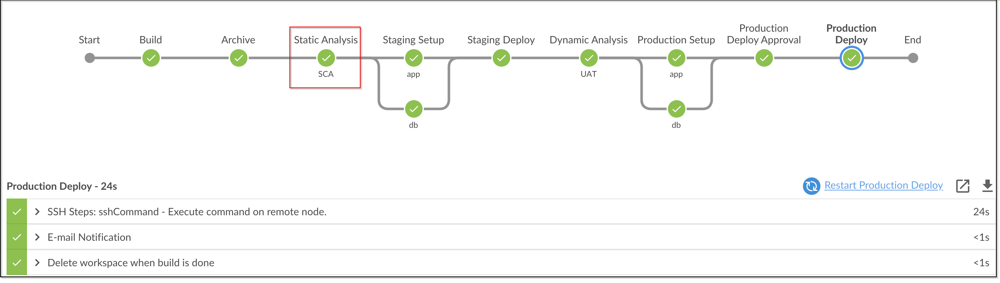

# Fixing SCA Issues

## Let's fix the issues now by performing below changes

### Edit pom.xml file in root folder
<!-- provide screenshot here of the location of pom.xml file from the IDE -->

Comment out the below Lines to stop using vulnerable dependencies :

```java
<struts.version>2.3.8</struts.version>
<commons.version>4.0</commons.version>
<struts2.tiles>2.3.16</struts2.tiles>
<tiles.core>2.0.6</tiles.core>
```

Add the updated dependencies

```java
<struts.version>2.3.37</struts.version>
<commons.version>4.2</commons.version>
<struts2.tiles>2.3.37</struts2.tiles>
<tiles.core>2.2.2</tiles.core>
```

Fire the below Git Commands to execute the Pipeline

```bash
git add .
```

```bash
git commit -am "fixed SCA"
```

```bash
git push
```



Status after fixing of issues


