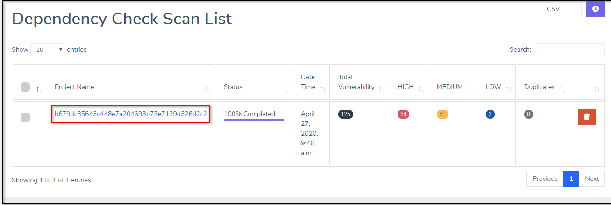
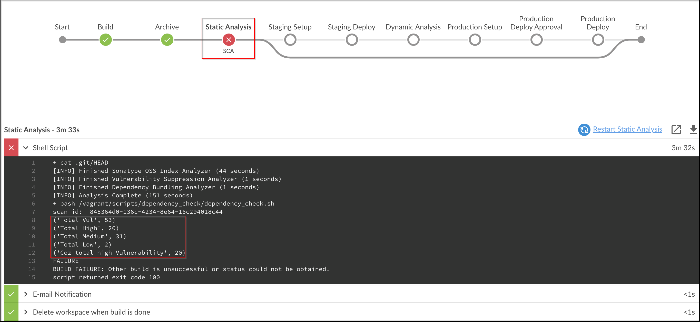
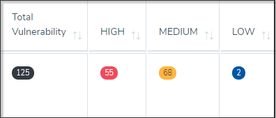

# Introduction to dependency check

Dependency-Check is a software composition analysis tool that identifies project dependencies on open-source code and checks if there are known vulnerabilities associated with that code. It was created by the Open Web Application Security Project (OWASP), a trusted non-profit organization aimed at improving the security of products and systems.
Currently, Dependency-Check offers full support for Java and .NET based products, experimental support for Ruby, Node.js, and Python products, and limited support for C and C++ products. It can be run through the CLI, as an Ant task, or through plugins with Maven, Jenkins, or Gradle. It is run from your environment and requires access to an Internet connection for periodic updating of database information. It does not include built-in automation and must be run manually or with an automation add on.


## Integrating Dependency check in DevOps pipeline

1. Copy Contents of `Jenkinsfile.SCA`

2. Paste the Contents into `Jenkinsfile` and Commit the code.

3. Fire the below Git Commands to execute the Pipeline

```bash
git add .
```

```bash
git commit -am "SCA"
```

```bash
git push
```

We can now see Dependency-Check Results in Archerysec as shown below :

[ArcherySec URL](../../labsetup/lab_info.md#archerysec)



## Pipeline

We observe that build has failed due to number of High issues identified as shown below :



Number of issues identified

