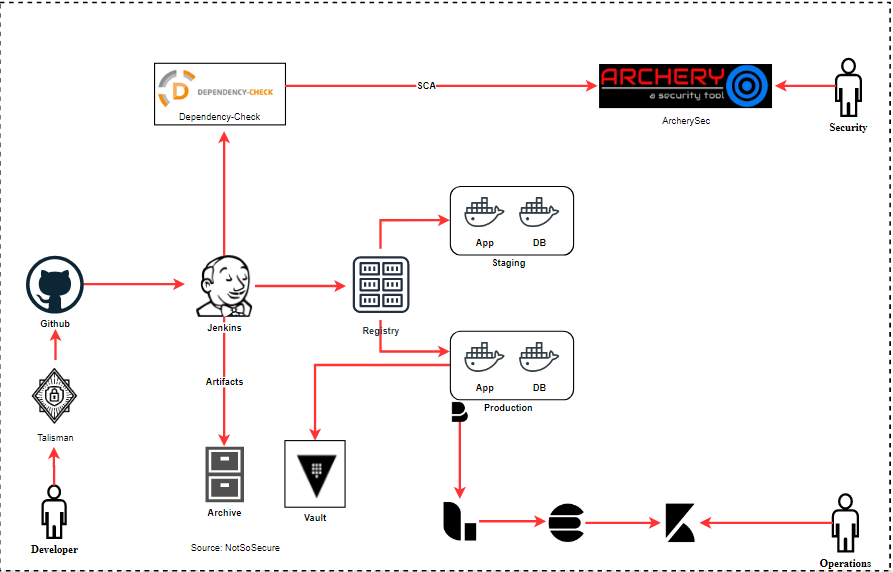

# Software Composition Analysis (SCA)

<!-- Brief Introduction about Software Composition Analysis -->
In September 2017, Equifax, a popular credit rating agency was breached leading to leakage of 143 million credit card numbers, personally identifiable information (PII) and much more. The vulnerability that was exploited was found in the “Struts2 Web Framework” (missing security patch) on which the primary web application was built. Just like Equifax, a lot of organizations make use of open source libraries/frameworks/solutions like WordPress, Magento, Drupal or even jQuery which are having new vulnerabilities being discovered every day.

Software Composition Analysis performs checks to identify these vulnerable/outdated 3rd party libraries from source code

