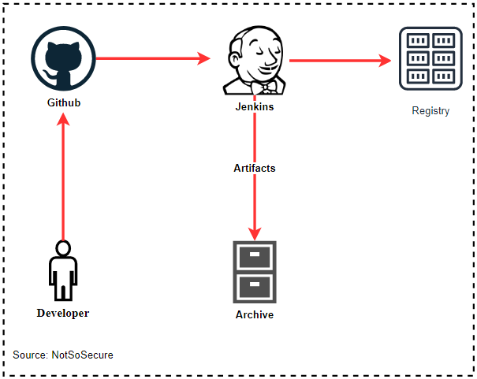

# Continuous Delivery

Continuous Delivery is a process where changes done by developers are automatically prepared for staging/production release. It deploys all the changes to a testing environment or production environment after build stage.

Continuous Delivery ensures that the changes/bug fixes or enhancement are pushed into the production environment more frequently.

  

