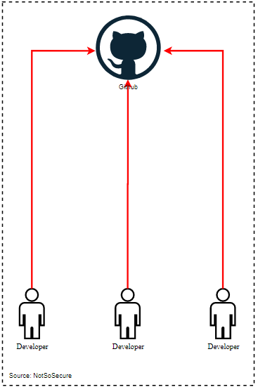

# Continuous Integration

Continuous integration is practice where developers regularly merge their code changes into a central repository, after which automated builds and tests are run to allow teams to detect problems/issues early.

In Continuous integration, developers commit their piece of code into a shared repository using a version control system such as Git.

Git is an open source and free version control systems, below are some commonly used Git commands which we will be using throughout our training

`git status` - Displays modified files in working directory which can be staged for next commit

`git add [file]` - Stage all the changes in specific file for next commit

`git commit -m "Message"`- Commit the staged changes with a commit/comment message

`git push` - Push the changes into remote branch with necessary commits and objects

  

