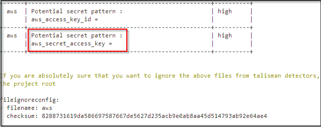
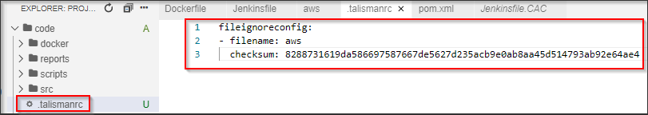
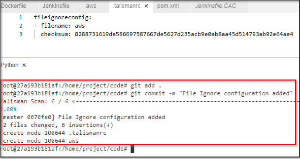
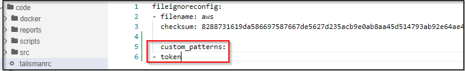
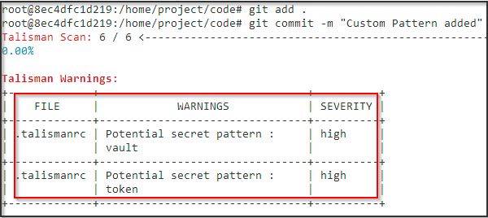
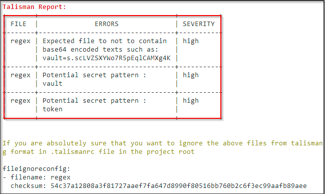

## Ignoring Files

There are times when talisman flagged security breach are either false positive or true positive. Talisman provides an option to ignore the security violation and proceed towards pushing that file into repository.

In such cases, we can use the .talismanrc file for creating exceptions or ignoring files.

At the moment, you can ignore

- filecontent
- filename
- filesize

As per our previous example, we can see that talisman has identified sensitive data getting pushed into the repository and has prevented the commit from happening :



We can ignore the above file from talisman detector by creating and configuring the .talismanrc file in project root with filename and checksum of the file as shown below :



Now that we have added our file in .talismanrc, lets now try to commit our data into repository



We have now successfully instructed talisman to ignore our file and proceed with the further build stage.

# Creating Regexes

<!-- Describe steps to create your own regexes in .talismanrc file-->
Talisman also supports custom regex patterns which can be used to identify sensitive information based on your business requirement.

Below is the format using which a new custom regex can be added in the .talismanrc file

```bash
custom_patterns:
- pattern1
- pattern2
```

Let's now create a new custom regex to identify if Vault token are getting accidentally exposed through our repository.

Add the below custom pattern is .talismanrc file

```bash
custom_patterns:
- token
```



Now let's create a new file called Token in the project root with following data :

```bash
Vault_token=s.scLVZSXYWo7R5pEqlCAMXg4K
```

Now lets save the file and try to commit the file to our local repository as shown below :




We can now see that talisman has stopped the commit from occurring. It has identified that a potential secret pattern “token” is getting committed and has stopped the commit.

Please note that any custom regex created will be highlighted as “High” severity issue by default and severity cannot be changed.

# Removing Talisman hook

To delete the aws credential file, Token file and .talismanrc created use the below command

```bash
rm -rf aws 
```

```bash
rm -rf .talismanrc 
```

```bash
rm -rf Token 
```

```bash
rm -rf .git/hooks
```
