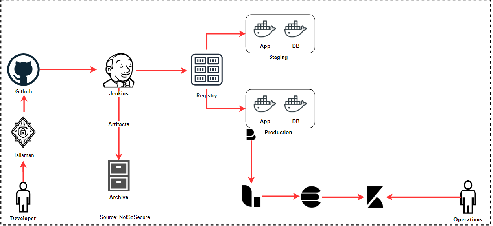

# Pre-Commit Hooks

Sensitive information such as the access keys, access tokens, SSH keys etc. are often erroneously leaked due to accidental git commits.

Pre-commit hooks can be installed on developer’s workstations to avoid the same, it works on pure Regex-based approach for filtering sensitive data

