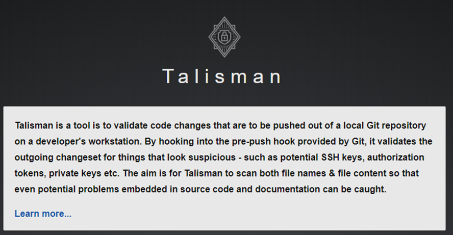
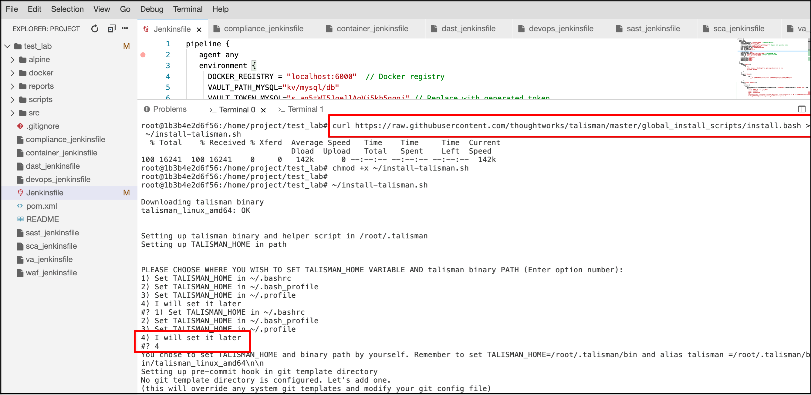
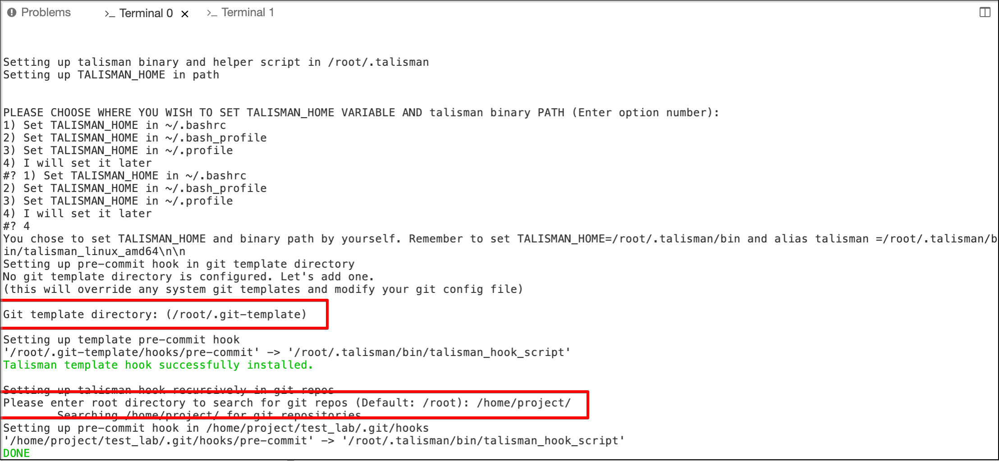
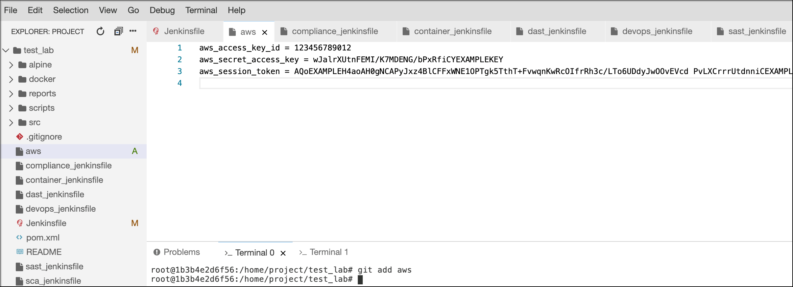
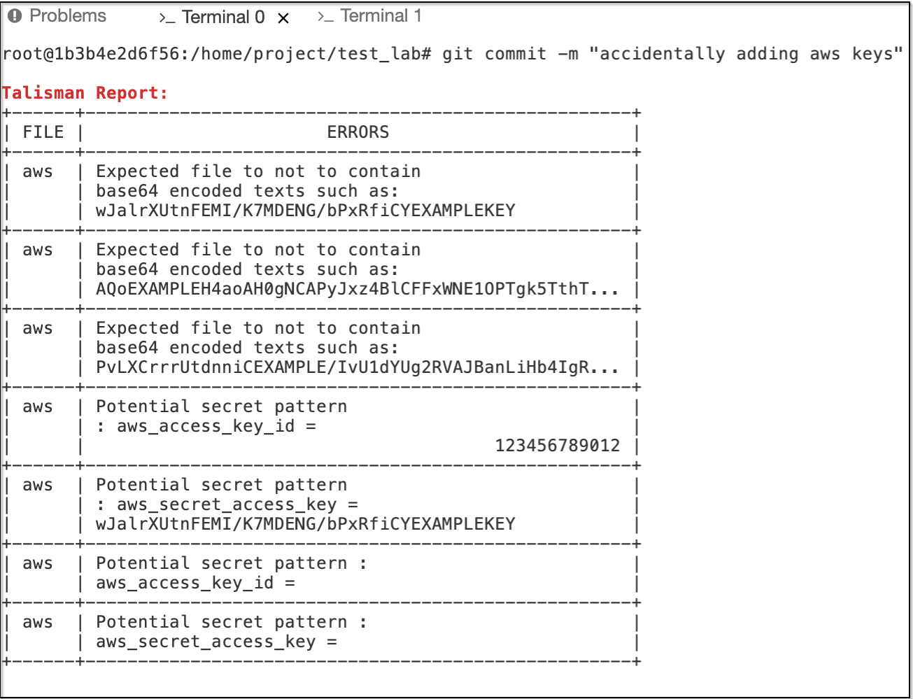

# Introduction to Talisman

Talisman is a tool that gets installed as a hook to your repository and validates code changes that are to be pushed out to a local git repository for potential secrets or sensitive information.

Talisman looks for sensitive information such as SSH keys, tokens, private keys, passwords etc

The aim of Talisman is to scan both file names and file content to identify potential sensitive information present in source code or in documentation, thereby preventing accidental disclosure by the developer.



## Install Talisman

```bash
curl https://raw.githubusercontent.com/thoughtworks/talisman/master/global_install_scripts/install.bash > ~/install-talisman.sh
```

```bash
chmod +x ~/install-talisman.sh
```

```bash
~/install-talisman.sh
```

We now receive a prompt to confirm location of TALISMAN_HOME VARIABLE AND talisman binary PATH

Select option - 4 as shown below :



Next we need to enter root directory as shown below:

```bash
Please enter root directory to search for git repos (Default: /root): /home/project/
```

> Don't forget to give your repo path



## Talisman in Action

Now let's see Talisman in action by creating the below config file

```bash
aws_access_key_id = 123456789012
aws_secret_access_key = wJalrXUtnFEMI/K7MDENG/bPxRfiCYEXAMPLEKEY
aws_session_token = AQoEXAMPLEH4aoAH0gNCAPyJxz4BlCFFxWNE1OPTgk5TthT+FvwqnKwRcOIfrRh3c/LTo6UDdyJwOOvEVcd PvLXCrrrUtdnniCEXAMPLE/IvU1dYUg2RVAJBanLiHb4IgRmpRV3zrkuWJOgQs8IZZaIv2BXIa2R4Olgk
```

Let's now add our file as shown below :

```bash
git add aws 
```



Now try to commit the changes as shown below :

```bash
git commit -m "accidentally adding aws keys"
```


