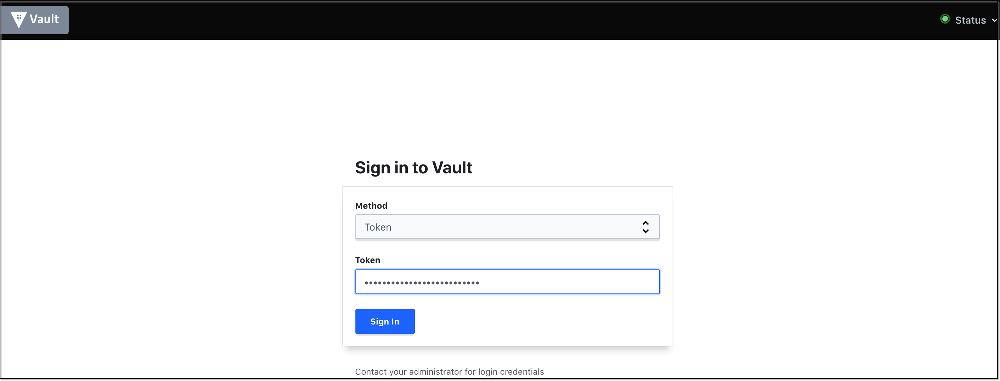
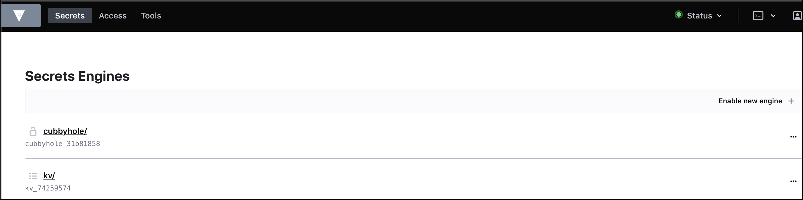
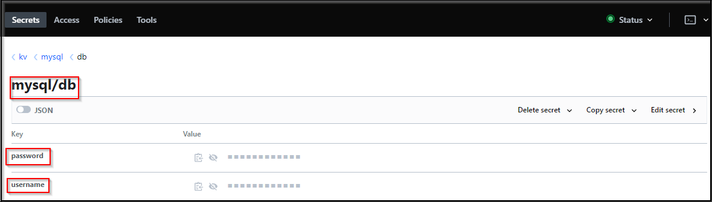
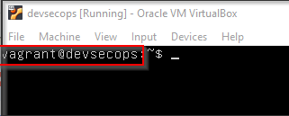
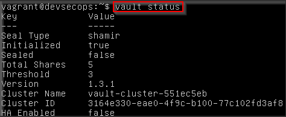
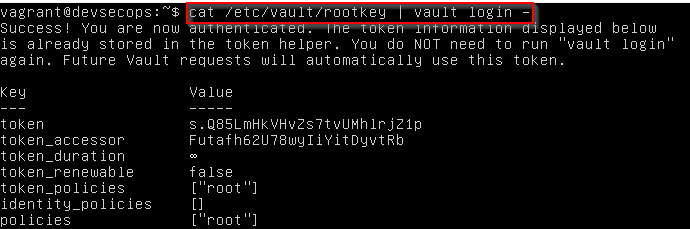
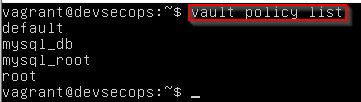
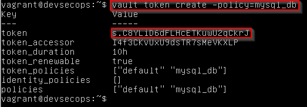

#Introduction to Vault

Vault is a tool for securely accessing secrets. A secret is anything that you want to tightly control access to, such as API keys, passwords, certificates, and more. Vault provides a unified interface to any secret, while providing tight access control and recording a detailed audit log.

A modern system requires access to a multitude of secrets: database credentials, API keys for external services, credentials for service-oriented architecture communication, etc. Understanding who is accessing what secrets is already very difficult and platform-specific. Adding on key rolling, secure storage, and detailed audit logs is almost impossible without a custom solution.

## Operating Vault

<!-- Need to Describe some of the commands of Vault provided below with proper screenshots. Just command one liner and screenshot of the command output should suffice.
Use screenshots from offline lab for explanation -->

### Vault GUI

[Vault GUI](../../labsetup/lab_info.md#vault)

Access the Vault GUI using Root Token as shown below :



Now Select kv/ to access the mysql key value pair as shown below :



mysql credentials stored in vault



## Vault Command Reference

```bash
vault status
vault operator init
vault operator unseal
vault login
http://192.168.30.110:8200/ui/vault/secrets
vault secrets enable kv
vault kv put kv/database/mysql username=root password=toor
vault kv get kv/database/mysql
echo 'path "kv/database/mysql" { capabilities = ["read","list"] }' | vault policy write mysqldb -
vault token create -policy=mysqldb -format=json | jq -r '.auth.client_token'
curl -X GET -H "X-Vault-Token:$VAULT_TOKEN" http://192.168.30.110:8200/v1/kv/database/mysql
```

## Vault token renewal

If your production application is not showing any data its most likely because the vault
token has expired. The best solution is to regenerate it using the following below steps:

First login to the VM using SSH



Next enter the first command to see the status of vault

`vault status`



Next lets login to vault using below command

`cat /etc/vault/rootkey | vault login -`



Let's list down all the policies present in vault now

`vault policy list`



Finally, lets create a new token for mysql_db policy

`vault token create -policy=mysql_db`



This token can now be used to provision our production setup
