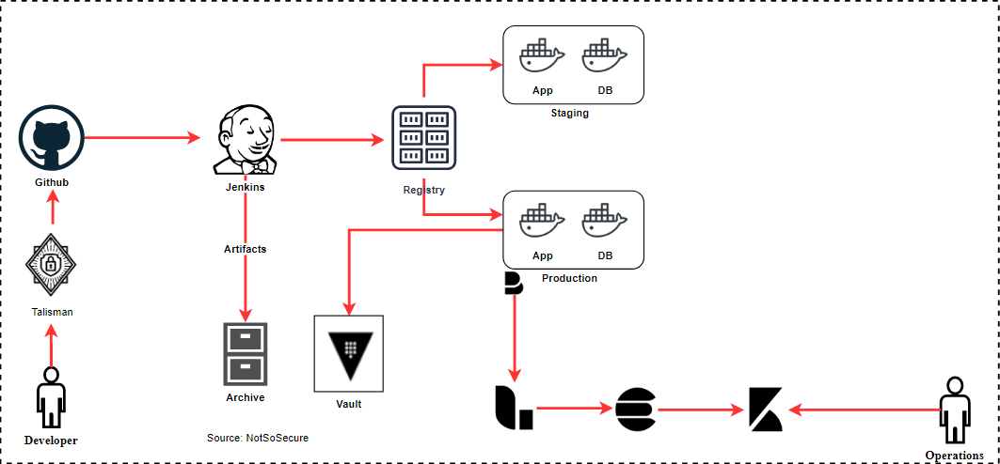

# Secrets Management

With automation, it is a common practice followed by developers and administrators to store credentials in configuration files, environment variables etc. for accessing various services. 

Storing credentials in the files or configuration can lead to exposure of credentials in the central repository where all the code and configuration is being stored.

This can be segregated by leveraging secret management services like “Hashicorp vault”. This allows segregation of credentials on a separate level and every environment can pull credentials from a specific environment and use it programmatically.

