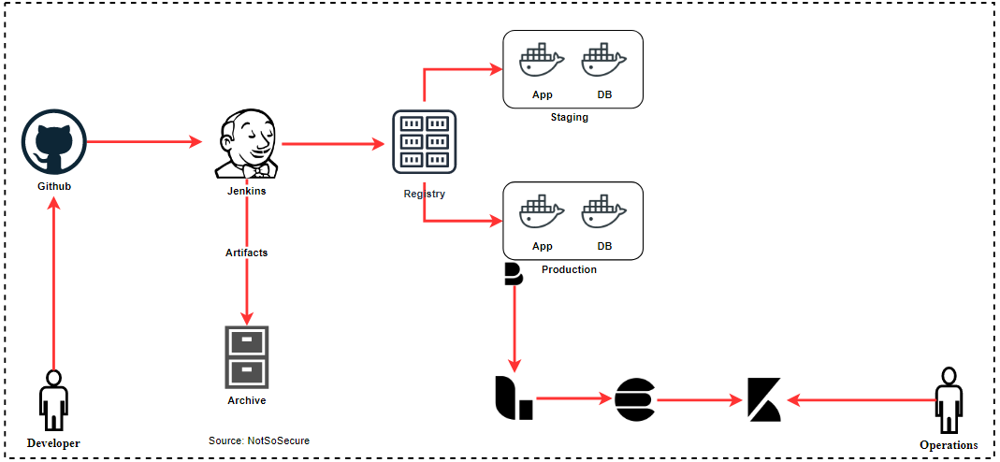

# Continuous Monitoring

<!-- Explain about each of the felk component what they are with their configuration file. Show location of configuration file in the ansible provision folder-->
Production applications are always faced with new threats from unknown and unforeseen vectors. This can be mitigated by having an active intrusion monitoring and prevention solution. One such opensource solution is the “ModSecurity WAF(Web Application Firewall) which detects OWASP Top 10 vulnerabilities like SQL injection, Cross-site scripting etc. being attempted against the application.
