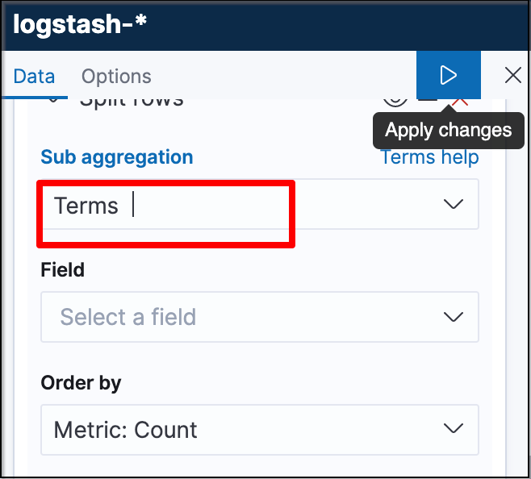
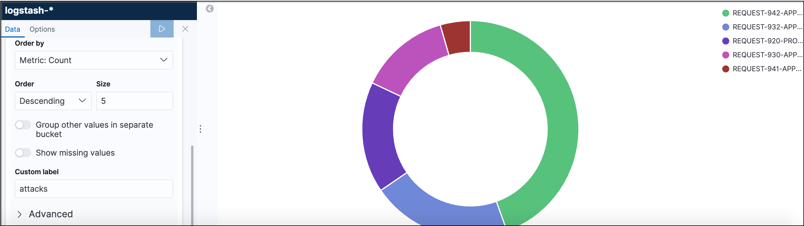

# Create Attack Dashboards in Kibana

<!-- Lab: Create Attack Dashboards -->

First from left hand menu select Visualize and then click on Create New Visualization

Under New Visualization, Select Data Table

Next select source as "logstash-*"

Next under buckets menu click on Add

Next select option Split rows under add bucket

Next under "Select an aggregation" select "Terms"

Under field drop down menu select "client.keyword" as filter

Now that we have created our filters, lets name the label as "IP"

Now click on Update to see information related to different IP address which are generating attack logs against our application

Lets add another sub bucket to view different attack names by selecting option "split rows"

Under select aggregation option from drop down select "Terms"

Now under field filter select "attack_name.keyword"

Add name of custom label as "Attacks" and then click on update to view different attack information as shown below :

Save the visualization by clicking save button

Now we can see our first visualization that we created

Now lets add a pie chart visualization to help analyze logs better

Select New Visualization and select pie as filter

Under buckets option select Split slices

Next select aggregation as "Terms", Field as "attack_name.keyword", order by as "Metric: Count" and order as "Descending"

Next click on update and now you can see pie chart daigram of different attacks

Now lets create a new dashboard to see data from both the visualization's created

From left hand menu select "Dashboard"

Next select create dashboard

Next under filters click "Add an existing"

Under Add panels select both our visualizations

Now we can see attacks logs both as pie chart and data table

Save the dashboard and this can now be used to view real time attack logs

