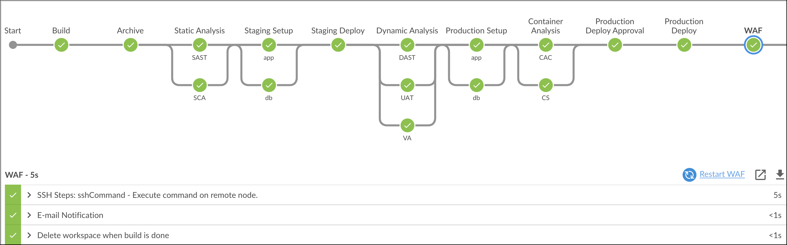
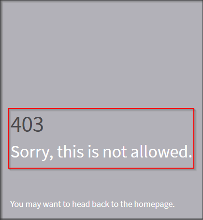

# Web Application Firewall

## Integrating WAF in DevOps pipeline

1. Copy Contents of `Jenkinsfile.WAF`

2. Paste the Contents into `Jenkinsfile` and Commit the code.

3. Fire the below Git Commands to execute the Pipeline

```bash
git add .
```

```bash
git commit -am "WAF"

```

```bash
git push
```



### Application in Production Behind WAF

[Production Behind WAF](../../labsetup/lab_info.md#production-waf)


### Perform some attack using malicious input on login page

[Production Behind WAF](../../labsetup/lab_info.md#production-waf)

