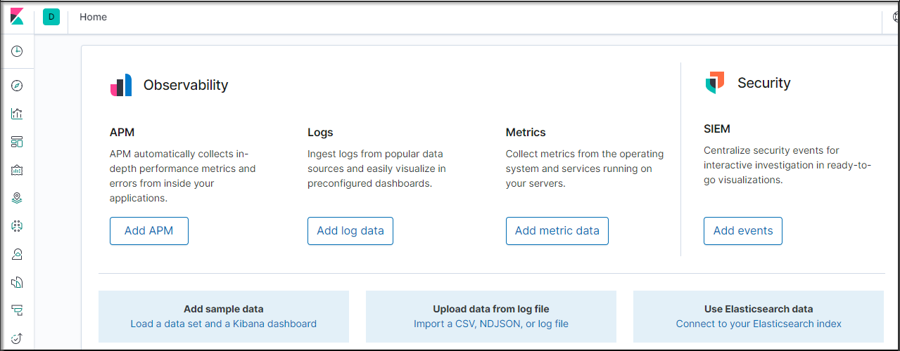
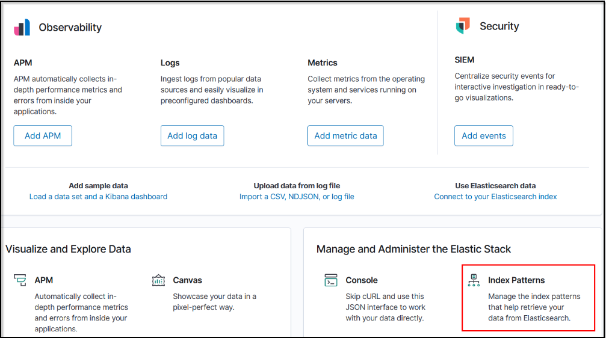
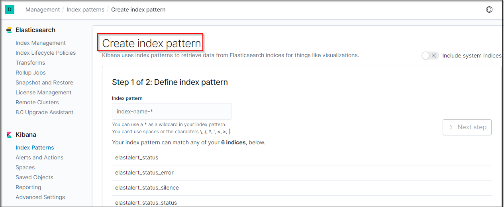
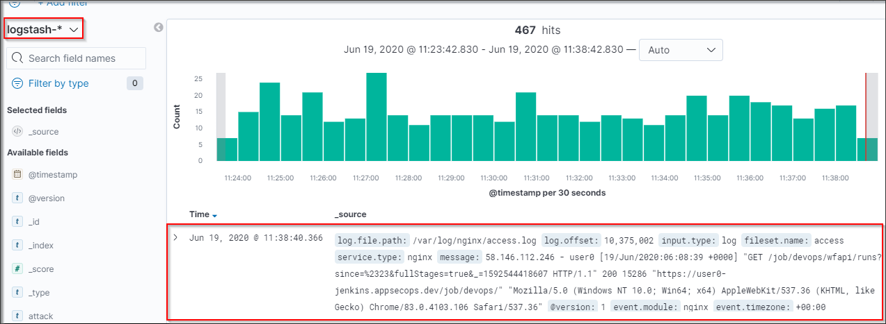
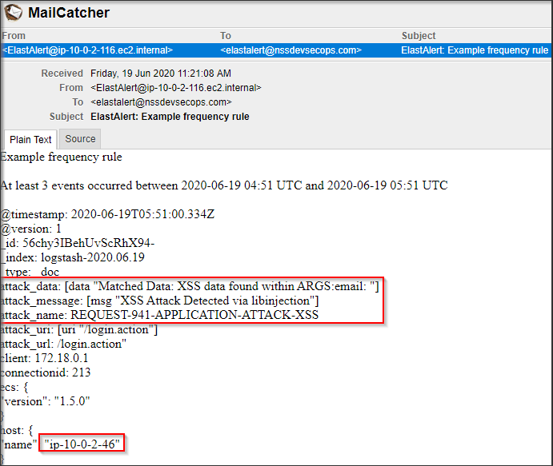

# View Logs in Kibana

<!-- Lab: View Logs in Kibana this demo to be shown here. So Provide instructions here as to how to see logs in Kibana for the first time 
Here we may need to tweak the logs folder that are being captured by filebeats to include normal logs as well
As here we are still not running the WAF.
-->

## Kibana

[Kibana URL](../../labsetup/lab_info.md#kibana)

## Setup up Kibana

1) Go to [Kibana URL](../../labsetup/lab_info.md#kibana)

2) Click on Index pattern 

3) Create Index pattern 
4) Type `logstash-*` in Index pattern
5) Next setup 

6) Time Filter field name `@timestamp`

7) Create Index pattern

8) Go to Discover

9) Open Mail Server

