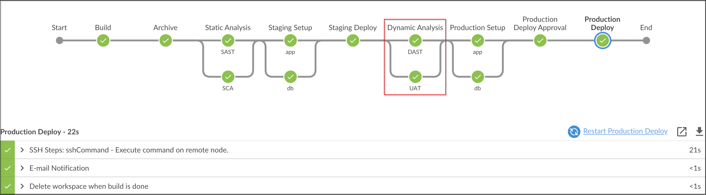
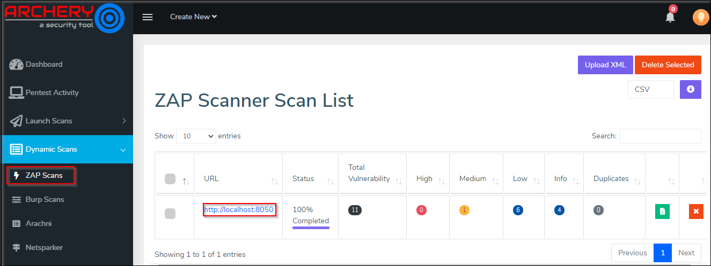

# Dynamic Analysis

## Integrating OWASP ZAP in DevOps pipeline

1. Copy Contents of `Jenkinsfile.DAST`

2. Paste the Contents into `Jenkinsfile` and Commit the code.

3. Fire the below Git Commands to execute the Pipeline


```bash
git add .
```

```bash
git commit -am "DAST"
```

```bash
git push
```



Post execution of pipeline, lets observe OWASP Zap Scanner results in Archerysec as shown below :

[ArcherySec URL](../../labsetup/lab_info.md#archerysec)


