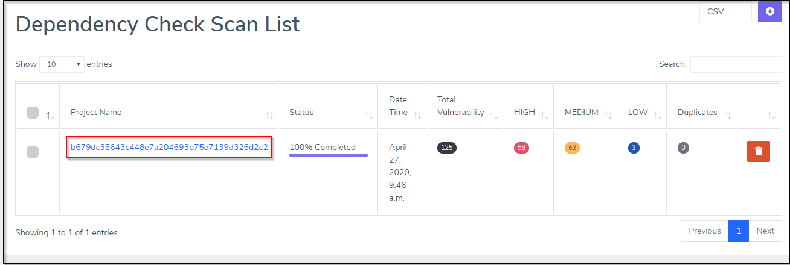
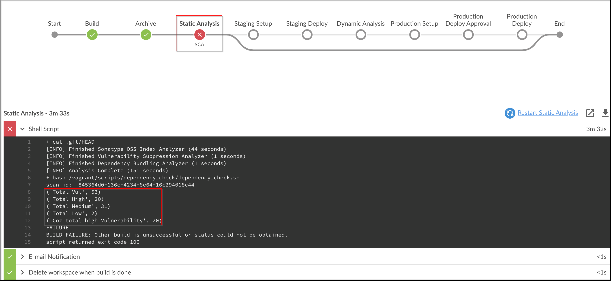
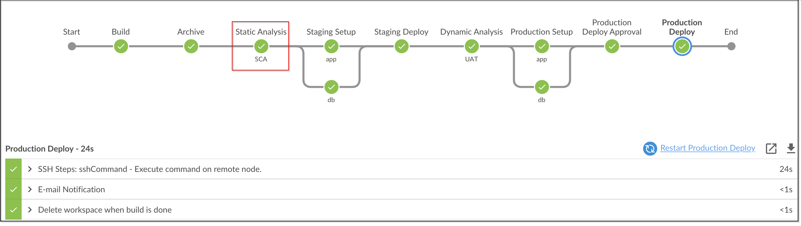

# Software Composition Analysis

## Integrating Dependency check in DevOps pipeline

1. Copy Contents of `Jenkinsfile.SCA`

2. Paste the Contents into `Jenkinsfile` and Commit the code.

3. Fire the below Git Commands to execute the Pipeline

```bash
git add .
```

```bash
git commit -am "SCA"
```

```bash
git push
```

We can now see Dependency-Check Results in Archerysec as shown below :

[ArcherySec URL](../../labsetup/lab_info.md#archerysec)



## Pipeline

We observe that build has failed due to number of High issues identified as shown below :




## Lets fix the issues now by performing below changes :

### Edit pom.xml file in root folder 

Comment out the below Lines to stop using vulnerable dependencies :

```java
<struts.version>2.3.8</struts.version>
<commons.version>4.0</commons.version>
<struts2.tiles>2.3.16</struts2.tiles>
<tiles.core>2.0.6</tiles.core>
```

Add the updated dependencies

```java
<struts.version>2.3.37</struts.version>
<commons.version>4.2</commons.version>
<struts2.tiles>2.3.37</struts2.tiles>
<tiles.core>2.2.2</tiles.core>
```
Fire the below Git Commands to execute the Pipeline

```bash
git add .
```

```bash
git commit -am "fixed SCA"
```

```bash
git push
```


