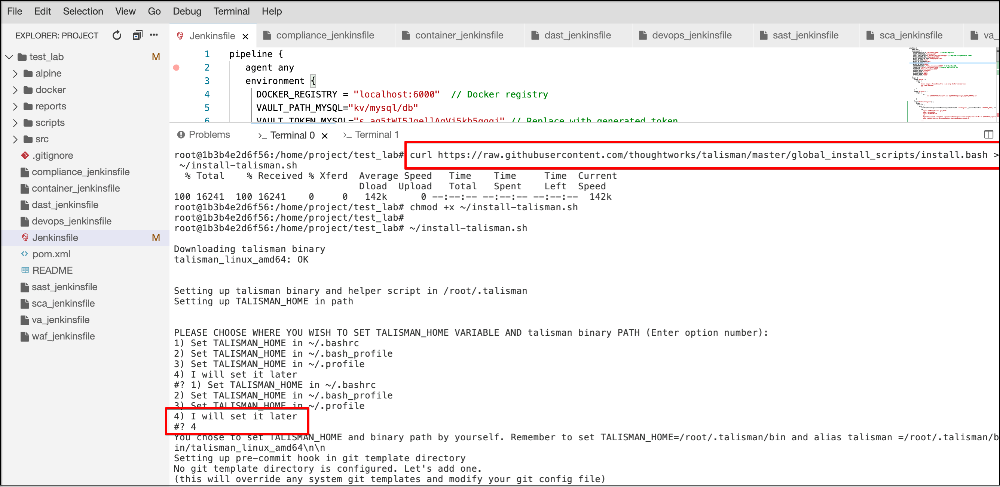
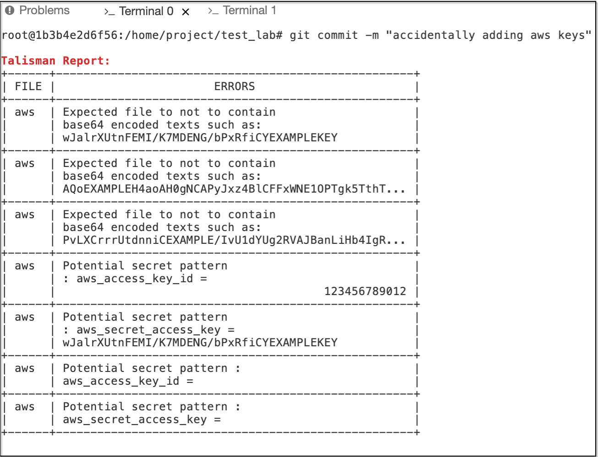

# Pre-commit Hook

## Install Talisman 

```bash
curl https://raw.githubusercontent.com/thoughtworks/talisman/master/global_install_scripts/install.bash > ~/install-talisman.sh
```

```bash
chmod +x ~/install-talisman.sh
```


```bash
~/install-talisman.sh
```
We now receive a prompt to confirm location of TALISMAN_HOME VARIABLE AND talisman binary PATH 

Select option - 4 as shown below :



Next prompt is to enter Git template directory : [/root/.git-template)]

just press enter and keep the setting as default


Next we need to enter root directory as shown above:

```bash
Please enter root directory to search for git repos (Default: /root): /home/project/
```

> Don't forget to give your repo path 

### Create config file with below data

```bash
aws_access_key_id = 123456789012
aws_secret_access_key = wJalrXUtnFEMI/K7MDENG/bPxRfiCYEXAMPLEKEY
aws_session_token = AQoEXAMPLEH4aoAH0gNCAPyJxz4BlCFFxWNE1OPTgk5TthT+FvwqnKwRcOIfrRh3c/LTo6UDdyJwOOvEVcd PvLXCrrrUtdnniCEXAMPLE/IvU1dYUg2RVAJBanLiHb4IgRmpRV3zrkuWJOgQs8IZZaIv2BXIa2R4Olgk
```
Lets now add our file as shown below :

```bash
git add aws 
```


Now try to commit the changes as shown below :

```bash
git commit -m "accidentally adding aws keys"
```




To delete the aws credential file created use the below command 

```bash
rm -rf aws 
```

Navigate to .git folder and type the below commmand to remove talisman hook

```bash
rm -rf hooks 
```
