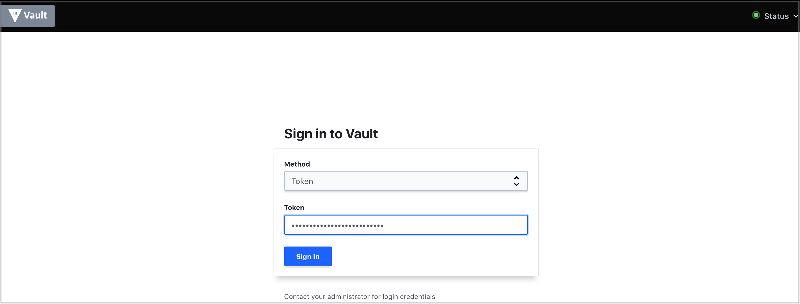
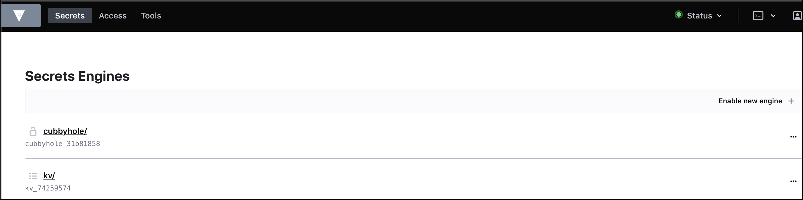
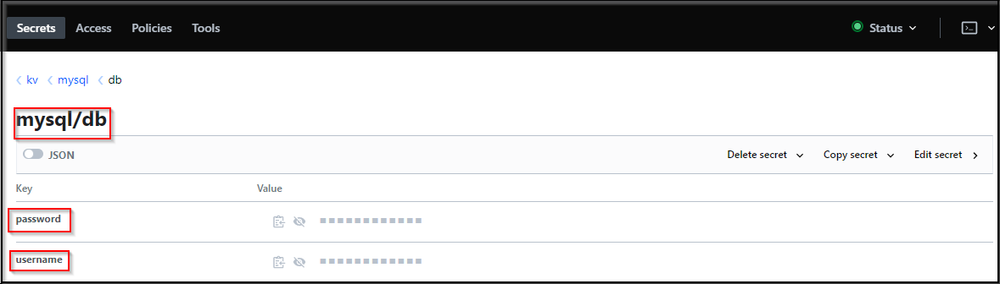

# Secret Management 

### Vault GUI
[Vault GUI](../../labsetup/lab_info.md#vault)

Access the Vault GUI using Root Token as shown below :



Now Select kv/ to access the mysql key value pair as shown below :



mysql credentials stored in vault



## Vault Command Reference
```bash
vault server -config=/etc/vault/config.json
export VAULT_ADDR=http://127.0.0.1:8200
vault status
vault operator init
vault operator unseal
vault login
vault kv put /secret/server/tomcat/credentials username=admin password=password
vault read /secret/server/tomcat/credentials
vault policy list
vault token create -policy=tomcat
curl -X GET -H "X-Vault-Token:$VAULT_TOKEN" http://127.0.0.1:8200/v1/secret/server/tomcat/credentials
```