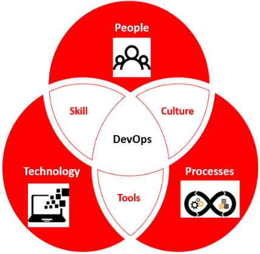

# Introduction to DevOps

DevOps is the IT practice of operations (Ops) and development engineers (Dev) participating together in the entire service lifecycle, from design through the development process to production support.

  

By Implementing DevOps practice, we achieve the below aspects :

1) Short build cycle and frequent release cycles

2) Multi-environment synergy 

3) Release day is treated as a normal day as releases are being pushed into production every few hours.

4) Scaling up the infrastructure is a lot more easy and requires less manpower
