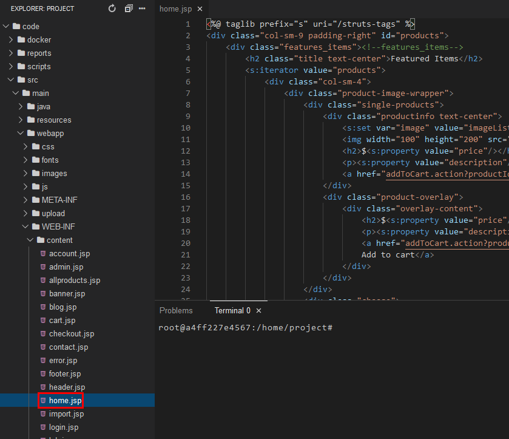
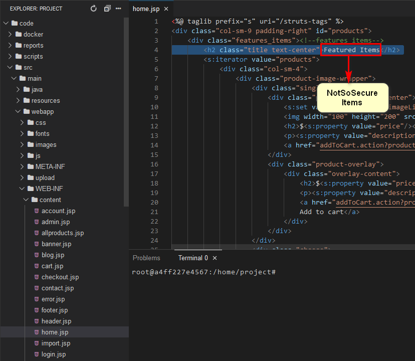
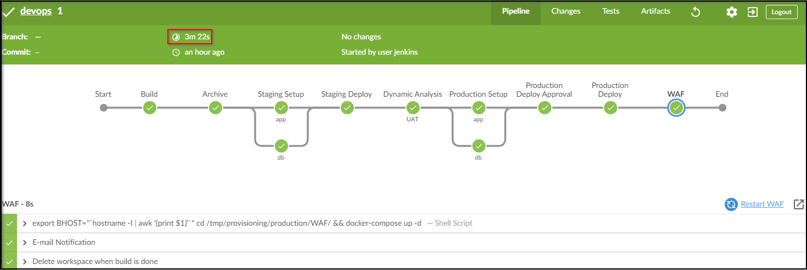

# DevOps Pipline

In order to understand the true power of devops lets now change a text in our code editor and observe the change reflect in just a few minutes.

1. Open the home.jsp file located at `src/main/webapp/WEB-INF/content/home.jsp` as shown below 



2. Next , lets edit the text "Featured Items" on line 4 of `src/main/webapp/WEB-INF/content/home.jsp` to whatever text you like as shown below.



3. Fire the below Git Commands to execute the Pipeline

```bash
git add .
```

```bash
git commit -am "updated featured text"
```

```bash
git push
```

## Pipeline

- Below is the sample representation of our build pipeline



## Staging App

[Staging URL](../labsetup/lab_info.md#staging)

- Once the build process is successfully completed, we can verify that our Staging application is up and running.

  

## Production App

[Production URL](../labsetup/lab_info.md#production)

- Approve the production deployment and verify that our Production application is now running.


