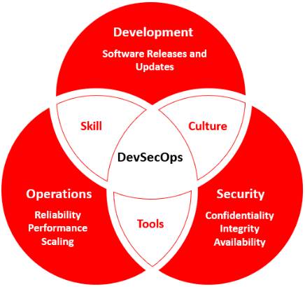

# Introduction to DevSecOps

DevSecOps is the methodology of integrating security tools within the DevOps process in an automated fashion. DevSecOps is not just about tooling but also having the required knowledge about using those tools. 

This leads to a cultural change in the normal functioning of DevOps and the staff needs to be trained and asked to upskill themselves on the same.

This allows them to collaborate more efficiently, thereby creating a “security culture”. This multicultural, multi-disciplinary automated security environment makes security everyone’s concern and not just of a single team which is also one of the major drivers of DevSecOps.

  

