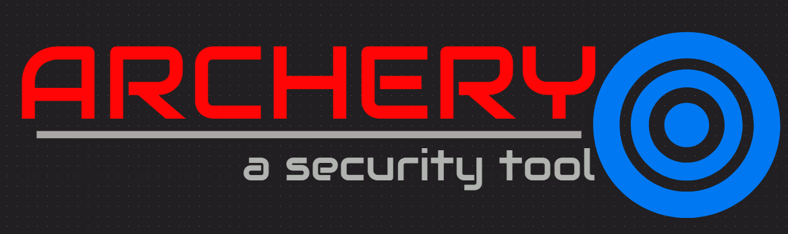

# Introduction to Vulnerability Management

> Effective Vulnerability management is at the heart of DevSecOps

Vulnerability management is a cyclical process of identifying, classifying, remediating and mitigating reported vulnerabilities

"The Best DevSecOps Teams make risk visible to developers"

## Introducing ArcherySec

The tools that we shall use to create a DevSecOps pipeline will generate plenty of vulnerabilities and each tool will have its own separate format. It becomes difficult to manage this data let alone track and remediate the vulnerabilities. Hence, vulnerability management solutions are at the core of a DevSecOps process where all tools are required to spool their data into those solutions so that it can be centrally managed, triaged, tracked and remediated.

“ArcherySec” is one such tool which not only has good integration with most of the tools but we can also initiate scans such as Zap and OpenVAS through ArcherySec.

  

