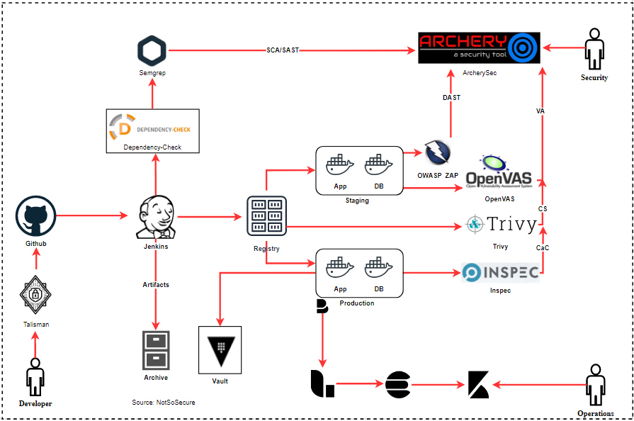

# Compliance as Code (CaC)

<!-- write in brief on CaC from slides -->

Organizations need to apply compliance controls to their IT infrastructure to abide by industry best practices and various regulations like PCI DSS, HIPAA, SOX etc. With “Infrastructure as Code” in DevOps, the production environment is never retained, it is always torn down and re-created again and hence it is a strong requirement to test the updated/newly created environment after it has been setup. “Inspec” is one such tool which can help us in performing these tests as we only need to supply a ruby file containing the tests to be conducted in a very simple and lucid manner which is easy for every audit professional to write and code.

