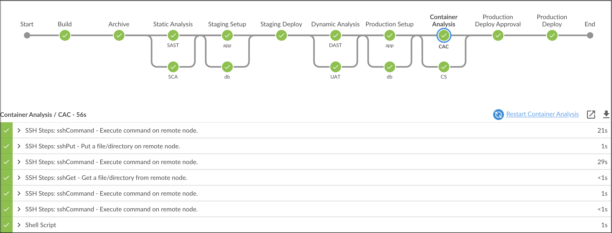
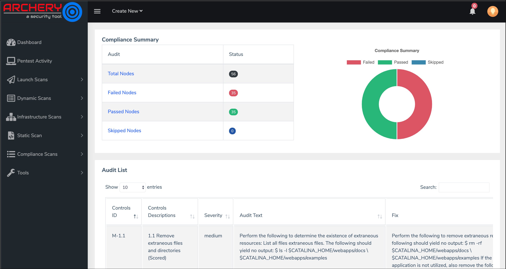

# Integrating Inspec in DevOps pipeline

1. Copy Contents of `Jenkinsfile.CAC`

2. Paste the Contents into `Jenkinsfile` and Commit the code.

3. Fire the below Git Commands to execute the Pipeline

```bash
git add .
```

```bash
git commit -am "CAC"
```

```bash
git push
```



Post execution of pipeline, lets observe Inspec results in ArcherySec

[ArcherySec URL](../../labsetup/lab_info.md#archerysec)

