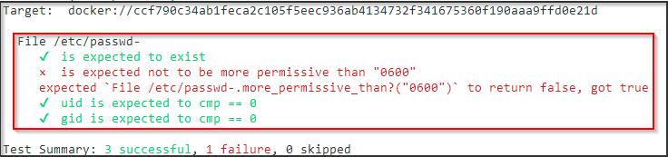

# Introduction to Inspec

Chef InSpec is an open-source tool which can be used for testing and auditing your applications and infrastructure. Chef InSpec compares the actual state of your system with the desired state that you express in easy-to-read and easy-to-write Chef InSpec code. Chef InSpec detects violations and displays findings in the form of a report, but puts you in control of remediation.


<!-- Write in brief on Inspec
Here we need to give audience two rules examples given below and make them execute those scripts on running docker containers 
Capture as many screenshots as possible
https://notsosecure.com/lets-cook-compliance-as-code-with-chef-inspec/
-->

## Inspec profile creation Hands-on

Let's first download Apache docker and run it on port 8088 using below command :

```bash
docker run -dit --name my-running-app -p 8088:80 httpd
```

Now lets capture the docker name using below command

```bash
docker ps | grep my-running-app
```

Once the docker name has been captured, Now let's create our sample config check file newrule.rb as shown below :

```ruby
describe file('/etc/passwd-') do
    it { should exist }
    it { should_not be_more_permissive_than('0600') }
    its('uid') { should cmp 0 }
    its('gid') { should cmp 0 }
  end
```

Once the file has been created, now let's execute our inspec script and check for compliance

```bash
inspec exec scripts/inspec/newrule.rb -t docker://"containerid" --chef-license=accept --reporter cli
```



Now lets run the below commands to change the permission of /etc/passwd file using below command and observe the compliance

```bash
docker exec -it "containerid" chmod 600 /etc/passwd-
```

```bash
inspec exec scripts/inspec/newrule.rb -t docker://"containerid" --chef-license=accept --reporter cli
```
