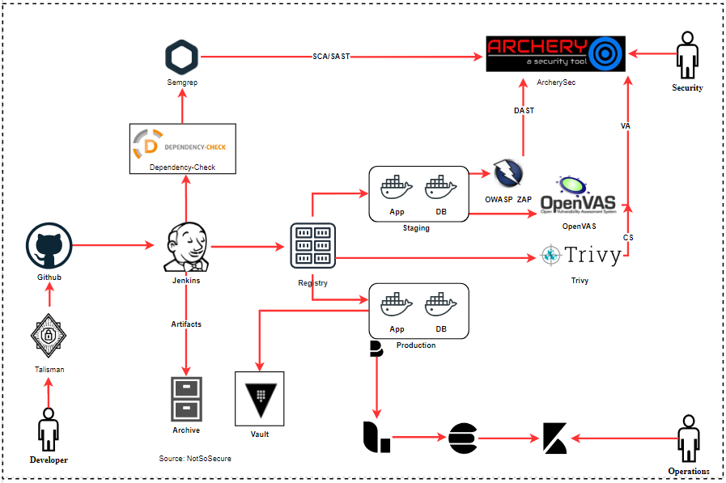

# Container Security (CS)

Containerization solutions like Docker are very popular while building the infrastructure using simple few lines of code. “Docker Hub” is a popular public docker repository from where docker images are pulled to run containers. 
There have been various instances in which these docker images are laced with malware or are riddled with various vulnerabilities. Hence, it is extremely important to scan these docker images that are being pulled from the public repository.

