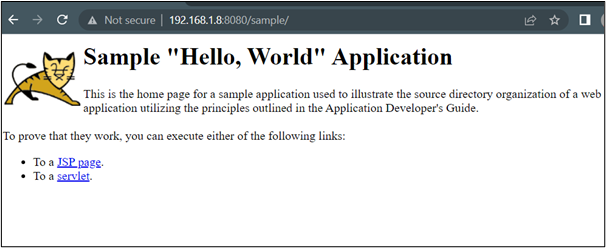

# Write a Dockerfile to setup a tomcat server


* Download a sample war file on the VM, that is provided by Tomcat

```bash
wget https://tomcat.apache.org/tomcat-8.5-doc/appdev/sample/sample.war
```

Output:
```bash
pentester@NotSoSecure:/tmp$ wget https://tomcat.apache.org/tomcat-8.5-doc/appdev/sample/sample.war
--2022-09-02 07:59:59--  https://tomcat.apache.org/tomcat-8.5-doc/appdev/sample/sample.war
Resolving tomcat.apache.org (tomcat.apache.org)... 151.101.2.132, 2a04:4e42::644
Connecting to tomcat.apache.org (tomcat.apache.org)|151.101.2.132|:443... connected.
HTTP request sent, awaiting response... 200 OK
Length: 4606 (4.5K)
Saving to: ‘sample.war’

sample.war                             100%[============================================================================>]   4.50K  --.-KB/s    in 0s

2022-09-02 07:59:59 (19.1 MB/s) - ‘sample.war’ saved [4606/4606]
```

* Create a Dockerfile as shown below (name the file Dockerfile)

```Dockerfile
  FROM tomcat:9.0.62
  ADD ./sample.war /usr/local/tomcat/webapps
  EXPOSE 8080
  CMD ["catalina.sh", "run"]
```

* Build an image with the above Dockerfile
```bash
docker build . -t tomcat-sample
```
Output:
```bash
pentester@NotSoSecure:/tmp/tomcat-sample$ ls
Dockerfile  sample.war
pentester@NotSoSecure:/tmp/tomcat-sample$ docker build . -t tomcat-sample
Sending build context to Docker daemon  7.168kB
Step 1/4 : FROM tomcat:9.0.62
9.0.62: Pulling from library/tomcat
67e8aa6c8bbc: Pull complete
627e6c1e1055: Pull complete
0670968926f6: Pull complete
5a8b0e20be4b: Pull complete
7a93fb438607: Pull complete
400f1e54bef0: Pull complete
f0b65b53f1a4: Pull complete
dc9d1a029c69: Pull complete
25dbf9415d2d: Pull complete
28cdc7690cfc: Pull complete
Digest: sha256:3593fef10852f51c1243c4e275ea6acba1441413271a04b6047da19259458b24
Status: Downloaded newer image for tomcat:9.0.62
 ---> 5e9a4d049871
Step 2/4 : ADD ./sample.war /usr/local/tomcat/webapps
 ---> 0442914842ea
Step 3/4 : EXPOSE 8080
 ---> Running in d6f2e2e65538
Removing intermediate container d6f2e2e65538
 ---> 6de7ecda33d6
Step 4/4 : CMD ["catalina.sh", "run"]
 ---> Running in 2821b27c8e0c
Removing intermediate container 2821b27c8e0c
 ---> bd638a673943
Successfully built bd638a673943
Successfully tagged tomcat-sample:latest
```
* Check the docker images :
```bash
docker images
```
Output:
```bash
pentester@NotSoSecure:/tmp/tomcat-sample$ docker images
REPOSITORY      TAG       IMAGE ID       CREATED          SIZE
tomcat-sample   latest    bd638a673943   20 seconds ago   680MB
alpine          latest    9c6f07244728   3 weeks ago      5.54MB
tomcat          9.0.62    5e9a4d049871   3 months ago     680MB
```
* Now run a container with the newly created image
```bash
docker run -dp 8080:8080 tomcat-sample
```
Output:
```bash
pentester@NotSoSecure:/tmp/tomcat-sample$ docker run -dp 8080:8080 tomcat-sample
92b55ca1a1a5727339bca195364d51675b4279f1afd123bcce74e4e3f598e94f
```
* Run the below command 
```bash
docker ps
```
Output:

```
pentester@NotSoSecure:/tmp/tomcat-sample$ docker ps
CONTAINER ID   IMAGE           COMMAND             CREATED         STATUS         PORTS                                       NAMES
92b55ca1a1a5   tomcat-sample   "catalina.sh run"   9 seconds ago   Up 7 seconds   0.0.0.0:8080->8080/tcp, :::8080->8080/tcp   amazing_spence
```

* Visit ```http://[VM-IP-Address]:8080/sample/``` to check the sample app deployed.

