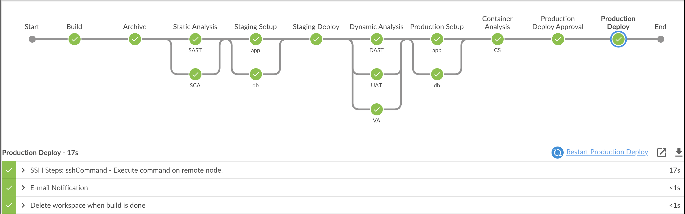
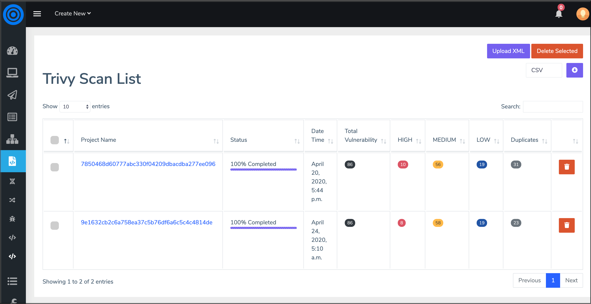

# Introduction to Trivy
Trivy (tri pronounced like trigger, vy pronounced like envy) is a simple and comprehensive vulnerability scanner for containers. A software vulnerability is a glitch, flaw, or weakness present in the software or in an Operating System. Trivy detects vulnerabilities of OS packages (Alpine, RHEL, CentOS, etc.) and application dependencies (Bundler, Composer, npm, yarn etc.). Trivy is easy to use. Just install the binary and you're ready to scan. All you need to do for scanning is to specify an image name of the container.


## Integrating Trivy in DevOps pipeline

1. Copy Contents of `Jenkinsfile.CS`

2. Paste the Contents into `Jenkinsfile` and Commit the code.

3. Fire the below Git Commands to execute the Pipeline

```bash
git add .
```

```bash
git commit -am "CS"
```

```bash
git push
```



Post execution of pipeline, lets observe Trivy Results In ArcherySec

[ArcherySec URL](../../labsetup/lab_info.md#archerysec)

