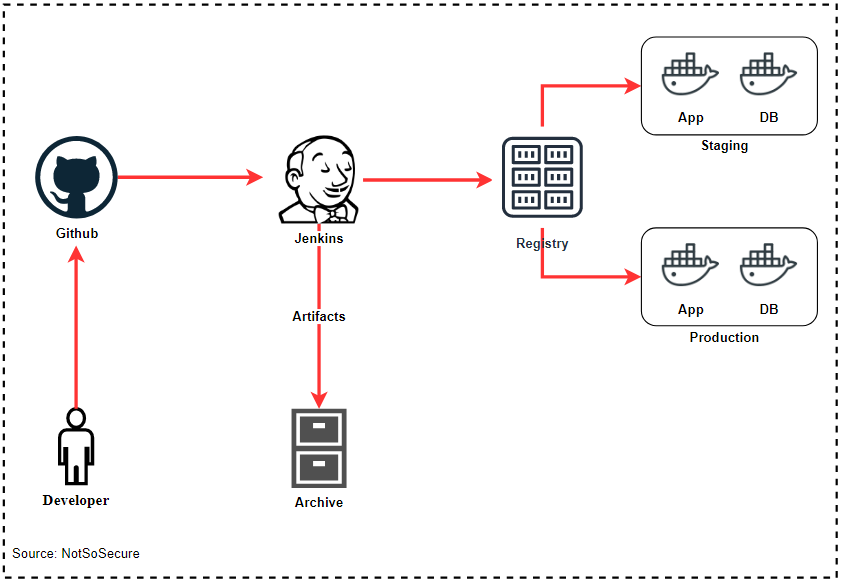

# Infrastructure As Code

Infrastructure as Code (IaC) is a way of automating infrastructure deployment and modifications by specifying the desired resource states in code. The code is written in specific, human-readable languages of IaC tools.

Infrastructure as a code allows you to document and version control the infrastructure, it also allows you to perform audit on the infrastructure

Containers are one of they key pieces for IaC and we will be extensively using Docker in our training as part of our IaC setup.

Docker can be used to create, deploy and run applications by just using Containers.

Dockers can automatically build images by just reading the instructions from a DockerFile.
Dockerfile is an instruction file or text document that has all the commands a user requires to build the image.Below Dockerfiles are that of our application and the database respectively.

App

```Dockerfile
FROM tomcat:9
ADD ./target/ROOT.war /usr/local/tomcat/webapps/
EXPOSE 8080
CMD ["catalina.sh", "run"]
```

DB

```Dockerfile
FROM mysql
COPY ./docker/db/sql-scripts/ /docker-entrypoint-initdb.d/
```

Below are some Docker commands references which can be used for building images :

- docker build : Builds an image from Dockerfile in specified directory
- docker pull : Pulls an image from registry
- docker tag : Tags an image with name as per the requirement
- docker run : Run a container from specific image

<p align="center">
  
</p>

