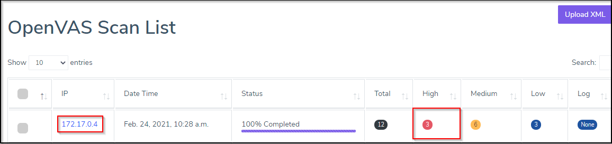

# Introduction to OpenVAS

The OpenVAS scanner is a comprehensive vulnerability assessment system that can detect security issues in all manner of servers and network devices. OpenVAS is an open source full featured vulnerability scanner with a constantly updated vulnerability database.
OpenVAS provides scalable architecture with plenty of plugins with simple installation and dockerized solution available as well.

<p align="center">
  
</p>

## Integrating OpenVAS Scanner in DevOps pipeline

1. Copy Contents of `Jenkinsfile.VA`

2. Paste the Contents into `Jenkinsfile` and Commit the code.

3. Fire the below Git Commands to execute the Pipeline

```bash
git add .
```

```bash
git commit -am "VA"
```

```bash
git push
```


Post execution of pipeline, lets observe OpenVAS Scan Results in ArcherySec

[ArcherySec URL](../../labsetup/lab_info.md#archerysec)


