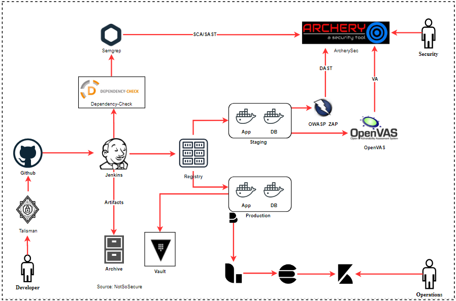

# Vulnerability Assessment (VA)

It is a general practice to perform vulnerability assessment on the production systems to identify various services running in the environment and the associated vulnerabilities.

While pointing a VA tool on the servers that have been created using Docker, it would execute the scan only on the service that is being exposed on that host. However, if we attach the tool to the docker network and then execute the scan, then it would give us a good picture of services which are actually running. This can be done using various solutions like OpenVAS which can easily integrate into the pipeline.

