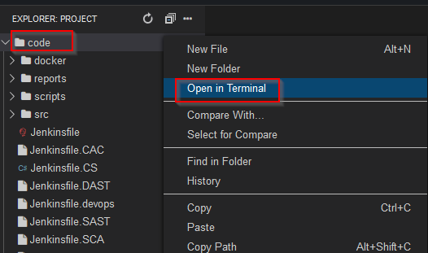
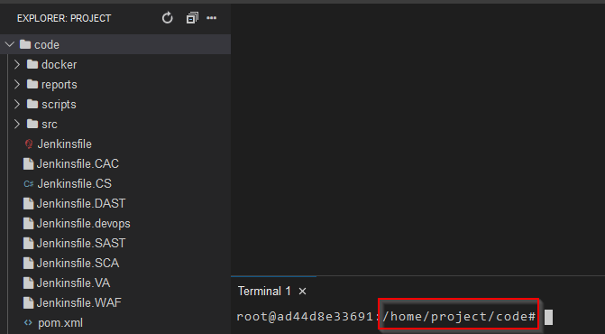
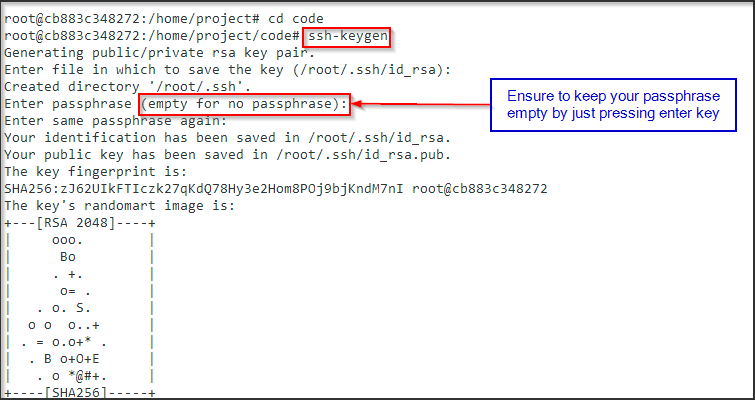
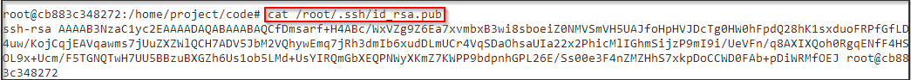
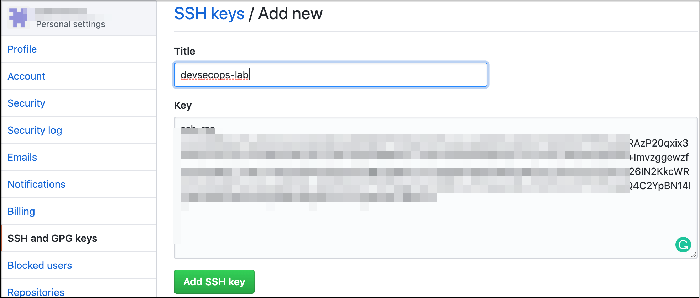
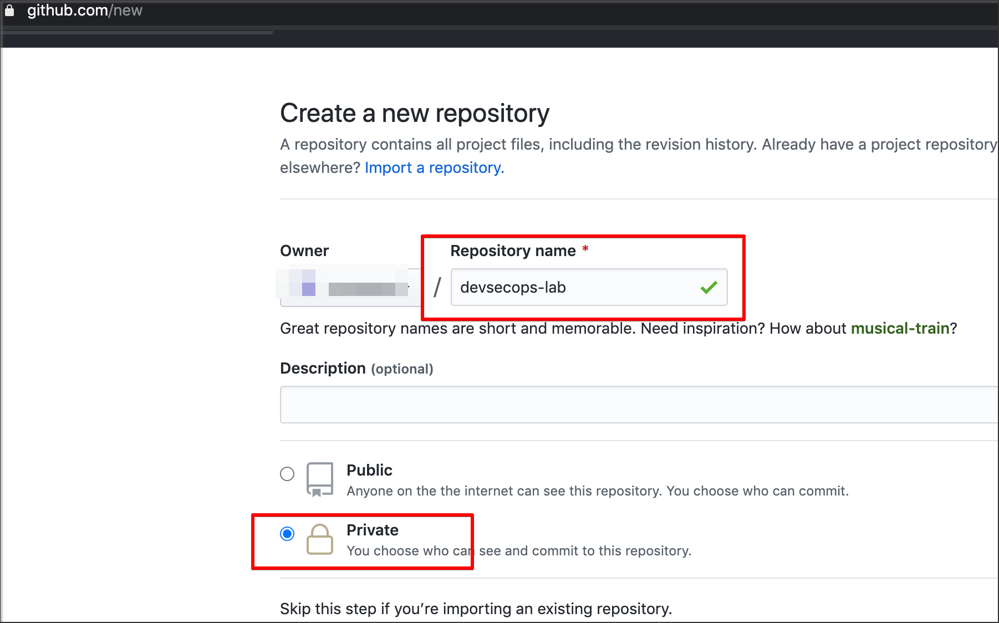

# Git Setup

## IDE URL

[IDE URL](../labsetup/lab_info.md#ide)

### SSH Key gen

Ensure that you are under code folder in terminal, the same can be ensured by right-clicking on code folder and selecting New Terminal as shown below :





Type below command and generate ssh key

```bash
ssh-keygen
```

> Note : Do not add passphrase to the public key generated and leave it as blank




### Copy ssh Public Key

```bash
cat /root/.ssh/id_rsa.pub
```



- Go to Github setting page.
- Select SSH and PGP key
- Create New SSH Key


- Add a new Title to SSH Key
- Upload SSH public key



## Create New Repository in GitHub

- Go to your Github account
- Create new repository 
- Name as devsecops-lab
- Select as Private repository



## Pushing our code to github.com

- First we need create a blank git repository using the command below
```bash
git init
```

- Now we need to stage our changes using the commands below
```bash
git add .
```
- Next we need to configure our email and name using the commands below
```bash
git config --global user.email "you@example.com"
```

```bash
git config --global user.name "Your Name"
```

- Let's commit our changes
```bash
git commit -m "first commit"
``` 

- Now select the branch using command below
```bash
git branch -M master
```

- lets now add our remote repository 

> (Please do not copy paste the below command as is , you need to update your git repository url as well)
<!-- On purpose not adding this under bash command as the origin file gets corrupted -->
git remote add origin git@github.com:test.git


- Finally, lets push our changes to our github.com repository
```bash
git push -u origin master
```