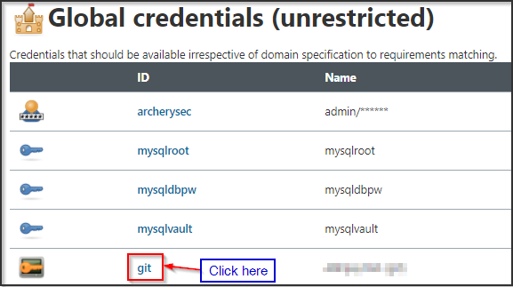
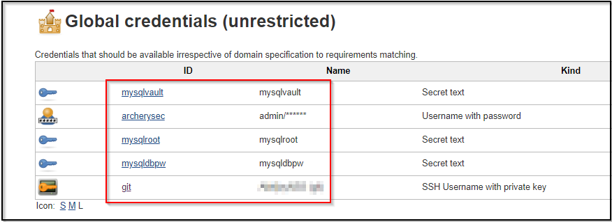

# Jenkins Setup

## Setup Jenkins Credentials

Login into jenkins server 

Go to Credentials 

1.	Enter the credentials “jenkins:jenkins” and proceed to ‘Sign In’

[Jenkins URL](../labsetup/lab_info.md#jenkins)

 

2.	On successful login you would be able to see the dashboard. Click on “Credentials” . 

 

Note - if jenkins credentials is not available in the left hand menu, Please locate as shown below :


3.	We have already added 5 different set of credentials that will be required for our pipeline build process as shown below :

 


*Note - We only need to modify git credentials and mysqlvault credentials, rest all credentials will remain as it is.

Lets now first modify our git credentials using below instructions :

### Github SSH setup in Jenkins

1. Click on Jenkins in Stores from parent section as shown below in image :

 

2. Click on Global credentials as shown below :

 

3. We need to modify git credentials hence click on git id as shown below :

 

4. Next click on update option from left hand menu as shown :

 

5. Next add your own github account username under "Username" field as shown :

 
 
6. Copy you private SSH key from SSH folder in IDE using below command and paste it under Private key option as shown :

```bash
cat /root/.ssh/id_rsa
```


### Vault Token setup in Jenkins

1. Click on back to global credentials as shown :

 

2. Select mysqlvault ID under global credentials as shown :

 

3. Next click on update option from left hand menu as shown :

 

4. Now under secret click on change password and add your vault token and click save.

Now confirm that you can see 5 different set of credentials added to jenkins



### ArhcerySec Credentials Setup (For on-prem-lab Only)

1.	Open your browser and open ArcherySec Application. 


2.	Click on the Sign Up button and enter the credentials as shown below. 


## Create your first DevSecOps Pipeline

1.	Open your browser and Login to Jenkins using the credentials 

`jenkins:jenkins`


2.	Click on “Create new jobs” to create a new job.


3.	Next enter some name (eg. ‘devops’ ) in the “Enter an item name” section.
Click “Pipeline” and then click “OK” at the bottom.


4.	Enter the Configuration details as specified below.


Poll SCM : * * * * *


Copy your git Repo ssh URL and provide into Jenkins


Ensure to uncheck the lightweight checkout option or else the changes in source code will not be visible


5.	Once the configuration is saved, a build will run.


6.	Click to open “Blue Ocean”. 


7.	Below is the progress as represented by Blue Ocean plugin. 


By the end of the ‘Staging Deploy’ stage your staging application should be up and running as shown below

[Staging URL](../labsetup/lab_info.md#staging)


Click On the ‘Production Deploy Approval’

Click OK to deploy


After approving the deployment our pipeline would be complete as shown below


Once the pipeline is complete please access the production application deployed as shown below 

[Production URL](../labsetup/lab_info.md#production)


