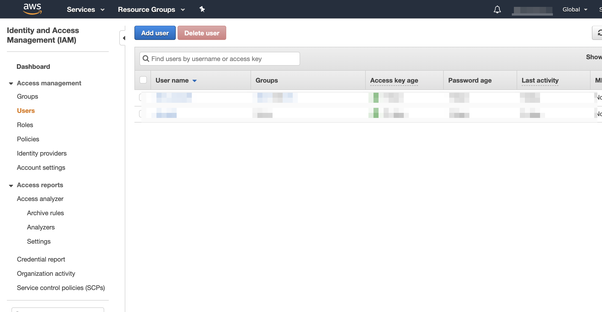
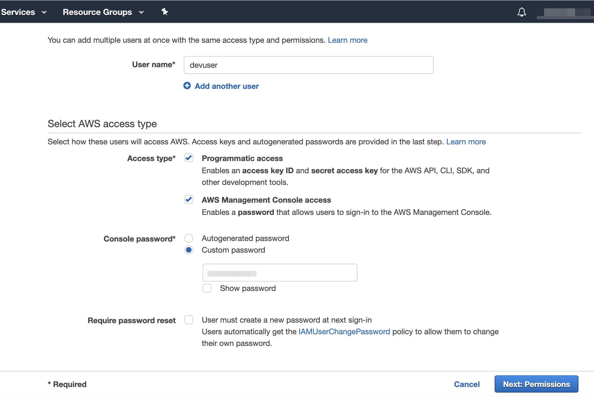
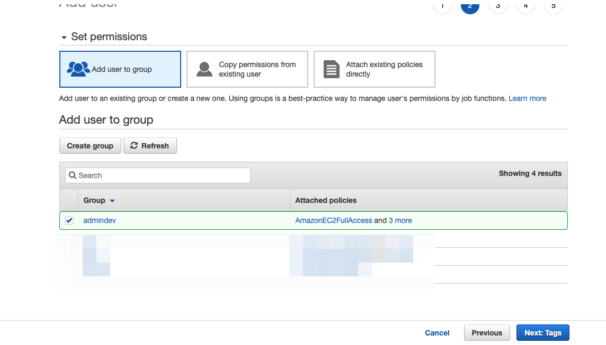
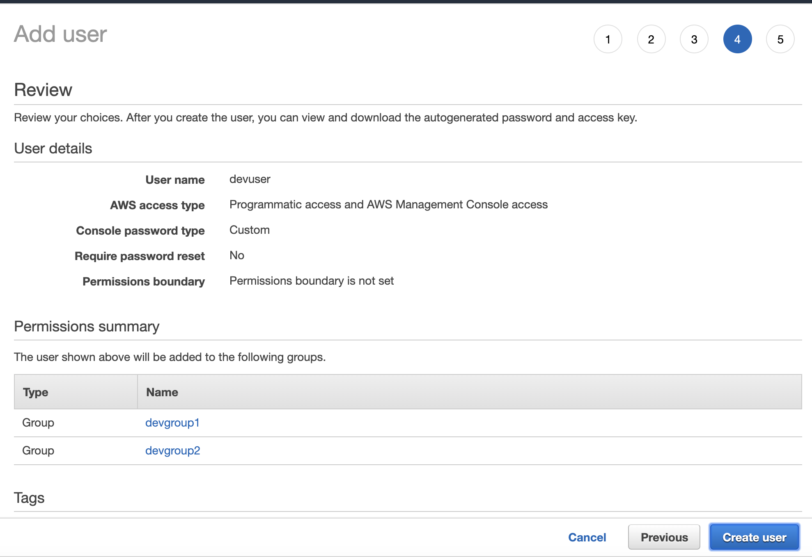

# Create User with prerequisites permissions

1. Login into AWS Console.
2. Go to IAM 
3. Go to Users



4. Click on *Add User*
5. *User name* : devuser
6. Select AWS access type > *Access type* > check both *Programmatic access* and *AWS Management Console access*
7. Console password >  *Custom password*
8. Require password reset > *Uncheck*



9. Click on *Next: Permission*
10. Create Group `admindev` and give following permissions



```bash
IAMFullAccess
```

```bash
AmazonEC2FullAccess
``` 

```bash
AWSCodeCommitFullAccess
```

```bash
AWSCloud9Administrator
```

13. Next: tags

14. Next: Review



15. Download .csv your aws credentials

>*Note: Keep aws credentials securely and don't share with anyone. Destroy user and credentials after this training.

16. Close

17. Now go to devuser > Security Credentials

18. Open Console Sign-in link : `https://xxxxxxxxxxx.signin.aws.amazon.com/console`

19. Provide username and password 

>Make sure that you are in us-east-1 region.
