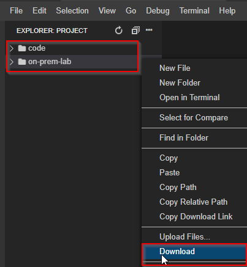

# Takeaway

<!-- ## Please note that the lab will be accessible to each delegate for next 24 Hours after the training ends to further practice. Post 24 hours the lab will be shutdown and each delegate can setup 'Vagrant + Ansible' Lab on thier respective systems using the Instruction Guides provided below. -->

- Download code folder and on-prem folder from LAB IDE by doing a right click and select download option as shown below :

 

### Follow the below instruction Guides to Install the entire DevSecOps environment for your respective OS (Linux Users can follow MAC)

- For Windows users

[https://drive.google.com/drive/folders/15S2_GiS8dMa9V6Org5WAPbQRN4g8bI3c](https://drive.google.com/drive/folders/15S2_GiS8dMa9V6Org5WAPbQRN4g8bI3c)

- For Linux/Mac users

[https://drive.google.com/drive/folders/15S2_GiS8dMa9V6Org5WAPbQRN4g8bI3c](https://drive.google.com/drive/folders/15S2_GiS8dMa9V6Org5WAPbQRN4g8bI3c)