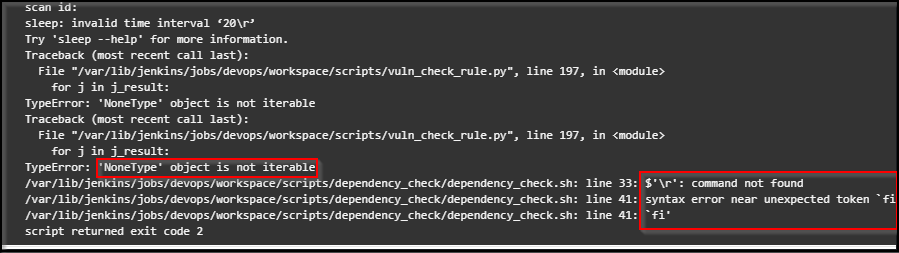
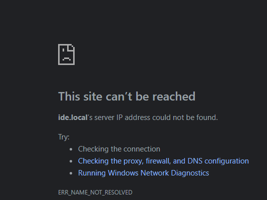

## CRLF and DNS Resolution issues :

### CRLF issue

During pipeline build stages if you encounter any issues related to CRLF or syntax errors, Kindly use dos2unix tool to rectify the issues as shown below



### Download dos2unix

Open terminal and type the below commands

```bash
apt-get update
```

```bash
apt-get install dos2unix
```

### Run dos2unix

Navigate to scripts folder and run the below command for each tool as shown below :

```bash
dos2unix dependency_check.sh
```

To fix all CRLF issue for shell scripts and python scripts use below command : 

```bash
find . -name '*.sh' -print0 | xargs -0 dos2unix
```

```bash
find . -name '*.py' -print0 | xargs -0 dos2unix
```

### DNS resolution issues

Post successfull execution of vagrant script, there might be cases were the websites will still might not be accessible as shown below :



It is recommended to ensure that the hosts file changes are done as mentioned in the setup document.
It has also been observed that Many anti-virus solutions keep resetting the hosts file to prevent DNS Hijacking attacks, Hence it is recommended to additionally check if there are any such issues and if possible disable AV while running the project and re-enable once all the pipeline stages are completed.
