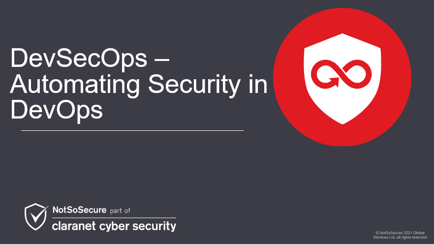

 
 
 

DevSecOps - Automating Security In DevOps
-----------------------------------------

Modern enterprises are implementing the technical and cultural changes required to embrace DevOps methodology by introducing practices such Continuous Integration (CI), Continuous Delivery (CD), Continuous Monitoring (CM) and Infrastructure as Code(IaC) .DevSecOps extends DevOps by introducing security in each of these practices giving a certain level of security assurance in the final product. In this training, we will demonstrate using our state-of-the-art DevSecOps Lab as to how to inject security in CI, CD, CM and IaC.
